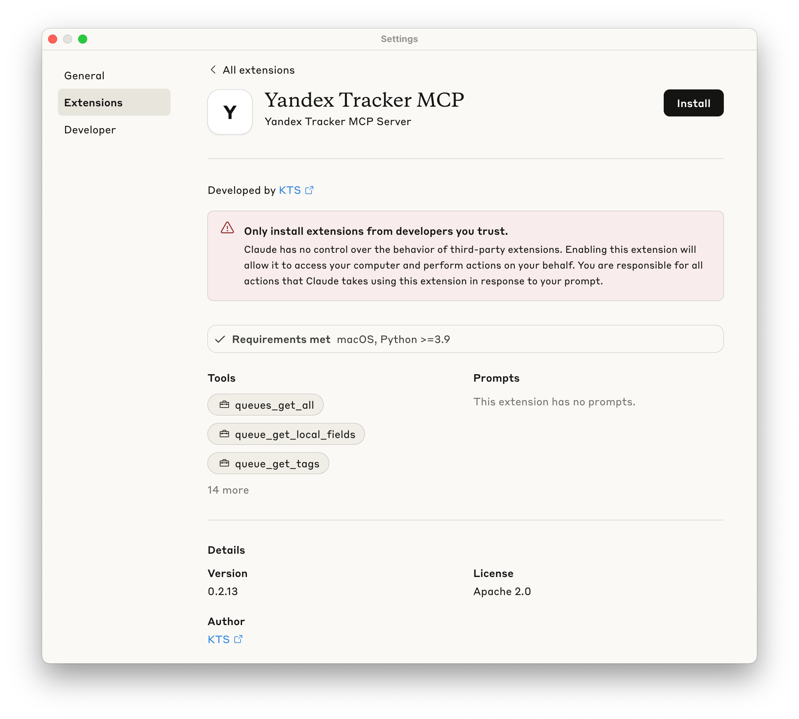
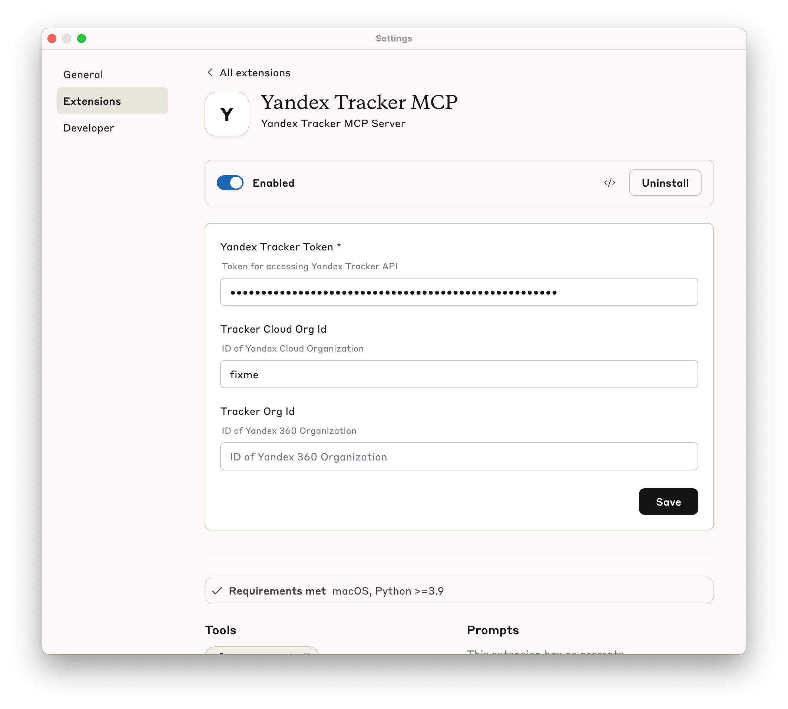

# Yandex Tracker MCP Server


[](https://smithery.ai/server/@aikts/yandex-tracker-mcp)

mcp-name: io.github.aikts/yandex-tracker-mcp

Комплексный MCP (Model Context Protocol) сервер, который позволяет ИИ-ассистентам взаимодействовать с API Яндекс.Трекера. Этот сервер обеспечивает безопасный, аутентифицированный доступ к задачам, очередям, комментариям, трудозатратам и функциям поиска Яндекс.Трекера с опциональным Redis-кешированием для улучшения производительности.

<a href="https://glama.ai/mcp/servers/@aikts/yandex-tracker-mcp">
  
</a>

## Возможности

- **Полное управление очередями**: Список и доступ ко всем доступным очередям Яндекс.Трекера с поддержкой пагинации и получением тегов
- **Управление пользователями**: Получение информации об учетных записях пользователей, включая данные для входа, адреса электронной почты, статус лицензии и данные организации
- **Операции с задачами**: Получение подробной информации о задачах, комментариев, связанных ссылок, трудозатрат и вложений
- **Управление полями**: Доступ к глобальным полям, локальным полям очереди, статусам и типам задач
- **Расширенный язык запросов**: Полная поддержка языка запросов Яндекс.Трекера со сложной фильтрацией, сортировкой
- **Кеширование производительности**: Опциональный слой кеширования Redis для улучшения времени отклика
- **Контроль безопасности**: Настраиваемые ограничения доступа к очередям и безопасная обработка токенов
- **Несколько вариантов транспорта**: Поддержка stdio, SSE (устаревший) и HTTP транспортов для гибкой интеграции
- **OAuth 2.0 аутентификация**: Динамическая аутентификация на основе токенов с автоматическим обновлением в качестве альтернативы статическим API-токенам
- **Поддержка организаций**: Совместимость как со стандартными, так и с облачными идентификаторами организаций

### Конфигурация идентификатора организации

Выберите один из следующих вариантов в зависимости от типа вашей организации Яндекса:

- **Организация Yandex Cloud**: Используйте переменную окружения `TRACKER_CLOUD_ORG_ID` для организаций, управляемых Yandex Cloud
- **Организация Яндекс 360**: Используйте переменную окружения `TRACKER_ORG_ID` для организаций Яндекс 360

Вы можете найти идентификатор вашей организации в URL Яндекс.Трекера или в настройках организации.

## Конфигурация MCP клиента

### Установка расширения в Claude Desktop

Yandex Tracker MCP Server можно установить в один клик в Claude Desktop как [расширение](https://www.anthropic.com/engineering/desktop-extensions).

#### Предварительные требования
Есть только одно требование - на вашей системе должен быть установлен python 3.12.

Для пользователей macOS вы можете установить его с помощью следующей команды:

```bash
brew install python@3.12
```

#### Установка

1. Скачайте файл `*.dxt` из [GitHub Releases](https://github.com/aikts/yandex-tracker-mcp/releases/latest) для вашей ОС и платформы.
2. Откройте скачанный файл, чтобы установить его в Claude Desktop. 
3. Введите ваш OAuth токен Яндекс.Трекера при запросе. 
4. Убедитесь, что расширение включено - теперь вы можете использовать этот MCP сервер.

### Ручная установка

#### Предварительные требования

- [uv](https://docs.astral.sh/uv/getting-started/installation/) установлен глобально
- Действительный API токен Яндекс.Трекера с соответствующими разрешениями

Следующие разделы показывают, как настроить MCP сервер для различных MCP-клиентов. Вы можете использовать либо `uvx yandex-tracker-mcp@latest`, либо Docker-образ `ghcr.io/aikts/yandex-tracker-mcp:latest`. Оба требуют следующие переменные окружения:

- Аутентификация (один из следующих):
  - `TRACKER_TOKEN` - Ваш OAuth токен Яндекс.Трекера
  - `TRACKER_IAM_TOKEN` - Ваш IAM токен
  - `TRACKER_SA_KEY_ID`, `TRACKER_SA_SERVICE_ACCOUNT_ID`, `TRACKER_SA_PRIVATE_KEY` - Учетные данные сервисного аккаунта
- `TRACKER_CLOUD_ORG_ID` или `TRACKER_ORG_ID` - Идентификатор вашей организации Yandex Cloud (или Яндекс 360)

<details>
<summary><strong>Claude Desktop</strong></summary>

**Путь к файлу конфигурации:**
- macOS: `~/Library/Application Support/Claude/claude_desktop_config.json`
- Windows: `%APPDATA%\Claude\claude_desktop_config.json`

**Используя uvx:**
```json
{
  "mcpServers": {
    "yandex-tracker": {
      "command": "uvx",
      "args": ["yandex-tracker-mcp@latest"],
      "env": {
        "TRACKER_TOKEN": "ваш_токен_трекера",
        "TRACKER_CLOUD_ORG_ID": "ваш_cloud_org_id",
        "TRACKER_ORG_ID": "ваш_org_id"
      }
    }
  }
}
```

**Используя Docker:**
```json
{
  "mcpServers": {
    "yandex-tracker": {
      "command": "docker",
      "args": [
        "run", "--rm", "-i",
        "-e", "TRACKER_TOKEN",
        "-e", "TRACKER_CLOUD_ORG_ID",
        "-e", "TRACKER_ORG_ID",
        "ghcr.io/aikts/yandex-tracker-mcp:latest"
      ],
      "env": {
        "TRACKER_TOKEN": "ваш_токен_трекера",
        "TRACKER_CLOUD_ORG_ID": "ваш_cloud_org_id",
        "TRACKER_ORG_ID": "ваш_org_id"
      }
    }
  }
}
```

</details>

<details>
<summary><strong>Claude Code</strong></summary>

**Используя uvx:**
```bash
claude mcp add yandex-tracker uvx yandex-tracker-mcp@latest \
  -e TRACKER_TOKEN=ваш_токен_трекера \
  -e TRACKER_CLOUD_ORG_ID=ваш_cloud_org_id \
  -e TRACKER_ORG_ID=ваш_org_id \
  -e TRANSPORT=stdio
```

**Используя Docker:**
```bash
claude mcp add yandex-tracker docker "run --rm -i -e TRACKER_TOKEN=ваш_токен_трекера -e TRACKER_CLOUD_ORG_ID=ваш_cloud_org_id -e TRACKER_ORG_ID=ваш_org_id -e TRANSPORT=stdio ghcr.io/aikts/yandex-tracker-mcp:latest"
```

</details>

<details>
<summary><strong>Cursor</strong></summary>

**Путь к файлу конфигурации:**
- Для проекта: `.cursor/mcp.json` в директории вашего проекта
- Глобальный: `~/.cursor/mcp.json`

**Используя uvx:**
```json
{
  "mcpServers": {
    "yandex-tracker": {
      "command": "uvx",
      "args": ["yandex-tracker-mcp@latest"],
      "env": {
        "TRACKER_TOKEN": "ваш_токен_трекера",
        "TRACKER_CLOUD_ORG_ID": "ваш_cloud_org_id",
        "TRACKER_ORG_ID": "ваш_org_id"
      }
    }
  }
}
```

**Используя Docker:**
```json
{
  "mcpServers": {
    "yandex-tracker": {
      "command": "docker",
      "args": [
        "run", "--rm", "-i",
        "-e", "TRACKER_TOKEN",
        "-e", "TRACKER_CLOUD_ORG_ID",
        "-e", "TRACKER_ORG_ID",
        "ghcr.io/aikts/yandex-tracker-mcp:latest"
      ],
      "env": {
        "TRACKER_TOKEN": "ваш_токен_трекера",
        "TRACKER_CLOUD_ORG_ID": "ваш_cloud_org_id",
        "TRACKER_ORG_ID": "ваш_org_id"
      }
    }
  }
}
```

</details>

<details>
<summary><strong>Windsurf</strong></summary>

**Путь к файлу конфигурации:**
- `~/.codeium/windsurf/mcp_config.json`

Доступ через: Настройки Windsurf → вкладка Cascade → Model Context Protocol (MCP) Servers → "View raw config"

**Используя uvx:**
```json
{
  "mcpServers": {
    "yandex-tracker": {
      "command": "uvx",
      "args": ["yandex-tracker-mcp@latest"],
      "env": {
        "TRACKER_TOKEN": "ваш_токен_трекера",
        "TRACKER_CLOUD_ORG_ID": "ваш_cloud_org_id",
        "TRACKER_ORG_ID": "ваш_org_id"
      }
    }
  }
}
```

**Используя Docker:**
```json
{
  "mcpServers": {
    "yandex-tracker": {
      "command": "docker",
      "args": [
        "run", "--rm", "-i",
        "-e", "TRACKER_TOKEN",
        "-e", "TRACKER_CLOUD_ORG_ID",
        "-e", "TRACKER_ORG_ID",
        "ghcr.io/aikts/yandex-tracker-mcp:latest"
      ],
      "env": {
        "TRACKER_TOKEN": "ваш_токен_трекера",
        "TRACKER_CLOUD_ORG_ID": "ваш_cloud_org_id",
        "TRACKER_ORG_ID": "ваш_org_id"
      }
    }
  }
}
```

</details>

<details>
<summary><strong>Zed</strong></summary>

**Путь к файлу конфигурации:**
- `~/.config/zed/settings.json`

Доступ через: `Cmd+,` (macOS) или `Ctrl+,` (Linux/Windows) или палитра команд: "zed: open settings"

**Примечание:** Требуется версия Zed Preview для поддержки MCP.

**Используя uvx:**
```json
{
  "context_servers": {
    "yandex-tracker": {
      "source": "custom",
      "command": {
        "path": "uvx",
        "args": ["yandex-tracker-mcp@latest"],
        "env": {
          "TRACKER_TOKEN": "ваш_токен_трекера",
          "TRACKER_CLOUD_ORG_ID": "ваш_cloud_org_id",
          "TRACKER_ORG_ID": "ваш_org_id"
        }
      }
    }
  }
}
```

**Используя Docker:**
```json
{
  "context_servers": {
    "yandex-tracker": {
      "source": "custom",
      "command": {
        "path": "docker",
        "args": [
          "run", "--rm", "-i",
          "-e", "TRACKER_TOKEN",
          "-e", "TRACKER_CLOUD_ORG_ID",
          "-e", "TRACKER_ORG_ID",
          "ghcr.io/aikts/yandex-tracker-mcp:latest"
        ],
        "env": {
          "TRACKER_TOKEN": "ваш_токен_трекера",
          "TRACKER_CLOUD_ORG_ID": "ваш_cloud_org_id",
          "TRACKER_ORG_ID": "ваш_org_id"
        }
      }
    }
  }
}
```

</details>

<details>
<summary><strong>GitHub Copilot (VS Code)</strong></summary>

**Путь к файлу конфигурации:**
- Рабочее пространство: `.vscode/mcp.json` в директории вашего проекта
- Глобальный: VS Code `settings.json`

**Вариант 1: Конфигурация рабочего пространства (рекомендуется для безопасности)**

Создайте `.vscode/mcp.json`:

**Используя uvx:**
```json
{
  "inputs": [
    {
      "type": "promptString",
      "id": "tracker-token",
      "description": "Токен Яндекс.Трекера",
      "password": true
    },
    {
      "type": "promptString",
      "id": "cloud-org-id",
      "description": "Идентификатор организации Yandex Cloud"
    },
    {
      "type": "promptString",
      "id": "org-id",
      "description": "Идентификатор организации Яндекс.Трекера (опционально)"
    }
  ],
  "servers": {
    "yandex-tracker": {
      "type": "stdio",
      "command": "uvx",
      "args": ["yandex-tracker-mcp@latest"],
      "env": {
        "TRACKER_TOKEN": "${input:tracker-token}",
        "TRACKER_CLOUD_ORG_ID": "${input:cloud-org-id}",
        "TRACKER_ORG_ID": "${input:org-id}",
        "TRANSPORT": "stdio"
      }
    }
  }
}
```

**Используя Docker:**
```json
{
  "inputs": [
    {
      "type": "promptString",
      "id": "tracker-token",
      "description": "Токен Яндекс.Трекера",
      "password": true
    },
    {
      "type": "promptString",
      "id": "cloud-org-id",
      "description": "Идентификатор организации Yandex Cloud"
    },
    {
      "type": "promptString",
      "id": "org-id",
      "description": "Идентификатор организации Яндекс.Трекера (опционально)"
    }
  ],
  "servers": {
    "yandex-tracker": {
      "type": "stdio",
      "command": "docker",
      "args": [
        "run", "--rm", "-i",
        "-e", "TRACKER_TOKEN",
        "-e", "TRACKER_CLOUD_ORG_ID",
        "-e", "TRACKER_ORG_ID",
        "ghcr.io/aikts/yandex-tracker-mcp:latest"
      ],
      "env": {
        "TRACKER_TOKEN": "${input:tracker-token}",
        "TRACKER_CLOUD_ORG_ID": "${input:cloud-org-id}",
        "TRACKER_ORG_ID": "${input:org-id}",
        "TRANSPORT": "stdio"
      }
    }
  }
}
```

**Вариант 2: Глобальная конфигурация**

Добавьте в VS Code `settings.json`:

**Используя uvx:**
```json
{
  "github.copilot.chat.mcp.servers": {
    "yandex-tracker": {
      "type": "stdio",
      "command": "uvx",
      "args": ["yandex-tracker-mcp@latest"],
      "env": {
        "TRACKER_TOKEN": "ваш_токен_трекера",
        "TRACKER_CLOUD_ORG_ID": "ваш_cloud_org_id",
        "TRACKER_ORG_ID": "ваш_org_id"
      }
    }
  }
}
```

**Используя Docker:**
```json
{
  "github.copilot.chat.mcp.servers": {
    "yandex-tracker": {
      "type": "stdio",
      "command": "docker",
      "args": [
        "run", "--rm", "-i",
        "-e", "TRACKER_TOKEN",
        "-e", "TRACKER_CLOUD_ORG_ID",
        "-e", "TRACKER_ORG_ID",
        "ghcr.io/aikts/yandex-tracker-mcp:latest"
      ],
      "env": {
        "TRACKER_TOKEN": "ваш_токен_трекера",
        "TRACKER_CLOUD_ORG_ID": "ваш_cloud_org_id",
        "TRACKER_ORG_ID": "ваш_org_id"
      }
    }
  }
}
```

</details>

<details>
<summary><strong>Другие MCP-совместимые клиенты</strong></summary>

Для других MCP-совместимых клиентов используйте стандартный формат конфигурации MCP сервера:

**Используя uvx:**
```json
{
  "mcpServers": {
    "yandex-tracker": {
      "command": "uvx",
      "args": ["yandex-tracker-mcp@latest"],
      "env": {
        "TRACKER_TOKEN": "ваш_токен_трекера",
        "TRACKER_CLOUD_ORG_ID": "ваш_cloud_org_id",
        "TRACKER_ORG_ID": "ваш_org_id"
      }
    }
  }
}
```

**Используя Docker:**
```json
{
  "mcpServers": {
    "yandex-tracker": {
      "command": "docker",
      "args": [
        "run", "--rm", "-i",
        "-e", "TRACKER_TOKEN",
        "-e", "TRACKER_CLOUD_ORG_ID",
        "-e", "TRACKER_ORG_ID",
        "ghcr.io/aikts/yandex-tracker-mcp:latest"
      ],
      "env": {
        "TRACKER_TOKEN": "ваш_токен_трекера",
        "TRACKER_CLOUD_ORG_ID": "ваш_cloud_org_id",
        "TRACKER_ORG_ID": "ваш_org_id"
      }
    }
  }
}
```

</details>

**Важные замечания:**
- Замените значения на ваши реальные учетные данные
- Перезапустите ваш MCP-клиент после изменения конфигурации
- При использовании `uvx` убедитесь, что `uvx` установлен и доступен в вашем системном PATH
- Для production использования рассмотрите использование переменных окружения вместо жесткого кодирования токенов

## Доступные MCP инструменты

Сервер предоставляет следующие инструменты через протокол MCP:

### Управление очередями
- **`queues_get_all`**: Список всех доступных очередей Яндекс.Трекера
  - Параметры:
    - `fields` (опционально): Поля для включения в ответ (например, ["key", "name"]). Помогает оптимизировать использование контекстного окна, выбирая только необходимые поля. Если не указано, возвращает все доступные поля.
    - `page` (опционально): Номер страницы для возврата. Если не указан, автоматически получает все страницы.
    - `per_page` (опционально): Количество элементов на страницу (по умолчанию: 100)
  - Возвращает информацию об очередях с пагинацией и выборочным включением полей
  - Учитывает ограничения `TRACKER_LIMIT_QUEUES`

- **`queue_get_local_fields`**: Получить локальные поля для конкретной очереди
  - Параметры: `queue_id` (строка, ключ очереди, например "SOMEPROJECT")
  - Возвращает специфические для очереди пользовательские поля с id, name и key
  - Учитывает ограничения `TRACKER_LIMIT_QUEUES`

- **`queue_get_tags`**: Получить все теги для конкретной очереди
  - Параметры: `queue_id` (строка, ключ очереди, например "SOMEPROJECT")
  - Возвращает список доступных тегов в указанной очереди
  - Учитывает ограничения `TRACKER_LIMIT_QUEUES`

- **`queue_get_versions`**: Получить все версии для конкретной очереди
  - Параметры: `queue_id` (строка, ключ очереди, например "SOMEPROJECT")
  - Возвращает список доступных версий в указанной очереди с деталями, такими как имя, описание, даты и статус
  - Учитывает ограничения `TRACKER_LIMIT_QUEUES`

### Управление пользователями
- **`users_get_all`**: Получить информацию об учетных записях пользователей, зарегистрированных в организации
  - Параметры:
    - `per_page` (опционально): Количество пользователей на страницу (по умолчанию: 50)
    - `page` (опционально): Номер страницы для возврата (по умолчанию: 1)
  - Возвращает пагинированный список пользователей с логином, электронной почтой, статусом лицензии и организационными деталями
  - Включает метаданные пользователя, такие как внешний статус, статус увольнения и настройки уведомлений

- **`user_get`**: Получить информацию о конкретном пользователе по логину или UID
  - Параметры: `user_id` (строка, логин пользователя, например "john.doe" или UID, например "12345")
  - Возвращает подробную информацию о пользователе, включая логин, электронную почту, статус лицензии и организационные детали
  - Поддерживает как имена входа пользователя, так и числовые идентификаторы пользователей для гибкой идентификации

- **`user_get_current`**: Получить информацию о текущем аутентифицированном пользователе
  - Параметры не требуются
  - Возвращает подробную информацию о пользователе, связанном с текущим токеном аутентификации
  - Включает логин, электронную почту, отображаемое имя и организационные детали для аутентифицированного пользователя

- **`users_search`**: Поиск пользователя по логину, электронной почте или реальному имени (имя или фамилия, или оба)
  - Параметры: `login_or_email_or_name` (строка, логин пользователя, электронная почта или реальное имя для поиска)
  - Возвращает одного пользователя или нескольких пользователей, если несколько совпадают с запросом, или пустой список, если ни один пользователь не соответствует
  - Использует нечеткое сопоставление для реальных имен с порогом сходства 80%
  - Приоритизирует точные совпадения для логина и электронной почты перед нечеткими совпадениями имен

### Управление полями
- **`get_global_fields`**: Получить все глобальные поля, доступные в Яндекс.Трекере
  - Возвращает полный список глобальных полей, которые можно использовать в задачах
  - Включает схему полей, информацию о типах и конфигурацию

### Управление статусами и типами
- **`get_statuses`**: Получить все доступные статусы задач
  - Возвращает полный список статусов задач, которые могут быть назначены
  - Включает идентификаторы статусов, имена и информацию о типах

- **`get_issue_types`**: Получить все доступные типы задач
  - Возвращает полный список типов задач для создания/обновления задач
  - Включает идентификаторы типов, имена и детали конфигурации

- **`get_priorities`**: Получить все доступные приоритеты задач
  - Возвращает полный список приоритетов, которые могут быть назначены задачам
  - Включает ключи приоритетов, имена и информацию о порядке

### Операции с задачами
- **`issue_get`**: Получить подробную информацию о задаче по ID
  - Параметры:
    - `issue_id` (строка, формат: "QUEUE-123")
    - `include_description` (логический, опционально, по умолчанию: true): Включать ли описание задачи в результат. Может быть большим, поэтому используйте только при необходимости.
  - Возвращает полные данные задачи, включая статус, исполнителя, описание и т.д.

- **`issue_get_url`**: Сгенерировать веб-URL для задачи
  - Параметры: `issue_id` (строка)
  - Возвращает: `https://tracker.yandex.ru/{issue_id}`

- **`issue_get_comments`**: Получить все комментарии для задачи
  - Параметры: `issue_id` (строка)
  - Возвращает хронологический список комментариев с метаданными

- **`issue_get_links`**: Получить связанные ссылки задачи
  - Параметры: `issue_id` (строка)
  - Возвращает ссылки на связанные, заблокированные или дублирующие задачи

- **`issue_get_worklogs`**: Получить записи трудозатрат
  - Параметры: `issue_ids` (массив строк)
  - Возвращает данные учета времени для указанных задач

- **`issue_get_attachments`**: Получить вложения для задачи
  - Параметры: `issue_id` (строка, формат: "QUEUE-123")
  - Возвращает список вложений с метаданными для указанной задачи

- **`issue_get_checklist`**: Получить элементы чек-листа задачи
  - Параметры: `issue_id` (строка, формат: "QUEUE-123")
  - Возвращает список элементов чек-листа, включая текст, статус, исполнителя и информацию о сроках

- **`issue_get_transitions`**: Получить возможные переходы статуса для задачи
  - Параметры: `issue_id` (строка, формат: "QUEUE-123")
  - Возвращает список доступных переходов, которые можно выполнить для задачи
  - Каждый переход включает ID, отображаемое имя и информацию о целевом статусе

- **`issue_create`**: Создать новую задачу в очереди
  - Параметры:
    - `queue` (строка, обязательно): Ключ очереди для создания задачи (например, 'MYQUEUE')
    - `summary` (строка, обязательно): Название/краткое описание задачи
    - `type` (строка, опционально): Ключ типа задачи (например, 'bug', 'task', 'story')
    - `description` (строка, опционально): Описание задачи
    - `assignee` (строка, опционально): Логин или UID исполнителя
    - `priority` (строка, опционально): Ключ приоритета (например, 'critical', 'high', 'normal', 'low')
    - `parent` (строка, опционально): Ключ родительской задачи (для подзадач)
    - `sprint` (массив строк, опционально): Список названий или ID спринтов
  - Возвращает объект новой созданной задачи со всеми стандартными полями задачи

### Поиск и обнаружение
- **`issues_find`**: Поиск задач с использованием [языка запросов Яндекс.Трекера](https://yandex.ru/support/tracker/ru/user/query-filter)
  - Параметры:
    - `query` (обязательно): Строка запроса с использованием синтаксиса языка запросов Яндекс.Трекера
    - `include_description` (логический, опционально, по умолчанию: false): Включать ли описание задачи в результат задач. Может быть большим, поэтому используйте только при необходимости.
    - `fields` (список строк, опционально): Поля для включения в ответ. Помогает оптимизировать использование контекстного окна, выбирая только необходимые поля. Если не указано, возвращает все доступные поля.
    - `page` (опционально): Номер страницы для пагинации (по умолчанию: 1)
    - `per_page` (опционально): Количество элементов на страницу (по умолчанию: 100). Может быть уменьшено, если результаты превышают контекстное окно.
  - Возвращает до указанного количества задач на страницу

- **`issues_count`**: Подсчет задач, соответствующих запросу с использованием [языка запросов Яндекс.Трекера](https://yandex.ru/support/tracker/ru/user/query-filter)
  - Параметры:
    - `query` (обязательно): Строка запроса с использованием синтаксиса языка запросов Яндекс.Трекера
  - Возвращает общее количество задач, соответствующих указанным критериям
  - Поддерживает все функции языка запросов: фильтрация полей, функции дат, логические операторы и сложные выражения
  - Полезно для аналитики, отчетности и понимания распределения задач без получения полных данных задач

## Транспорт http

MCP сервер также может работать в режиме streamable-http для веб-интеграций или когда транспорт stdio не подходит.

### Переменные окружения режима streamable-http

```env
# Обязательно - Установить транспорт в режим streamable-http
TRANSPORT=streamable-http

# Конфигурация сервера
HOST=0.0.0.0  # По умолчанию: 0.0.0.0 (все интерфейсы)
PORT=8000     # По умолчанию: 8000
```

### Запуск streamable-http сервера

```bash
# Базовый запуск streamable-http сервера
TRANSPORT=streamable-http uvx yandex-tracker-mcp@latest

# С пользовательским хостом и портом
TRANSPORT=streamable-http \
HOST=localhost \
PORT=9000 \
uvx yandex-tracker-mcp@latest

# Со всеми переменными окружения
TRANSPORT=streamable-http \
HOST=0.0.0.0 \
PORT=8000 \
TRACKER_TOKEN=ваш_токен \
TRACKER_CLOUD_ORG_ID=ваш_org_id \
uvx yandex-tracker-mcp@latest
```

Вы можете пропустить настройку `TRACKER_CLOUD_ORG_ID` или `TRACKER_ORG_ID`, если используете следующий формат при подключении к MCP серверу (пример для Claude Code):

```bash
claude mcp add --transport http yandex-tracker "http://localhost:8000/mcp/?cloudOrgId=ваш_cloud_org_id&"
```

или

```bash
claude mcp add --transport http yandex-tracker "http://localhost:8000/mcp/?orgId=org_id&"
```

Вы также можете пропустить настройку глобальной переменной окружения `TRACKER_TOKEN`, если выберете использование OAuth 2.0 аутентификации (см. ниже).

### OAuth 2.0 аутентификация

Yandex Tracker MCP Server поддерживает OAuth 2.0 аутентификацию как безопасную альтернативу статическим API токенам. При настройке сервер выступает в качестве OAuth провайдера, облегчая аутентификацию между вашим MCP клиентом и сервисами Яндекс OAuth.

#### Как работает OAuth

MCP сервер реализует стандартный поток кода авторизации OAuth 2.0:

1. **Регистрация клиента**: Ваш MCP клиент регистрируется на сервере для получения учетных данных клиента
2. **Авторизация**: Пользователи перенаправляются в Яндекс OAuth для аутентификации
3. **Обмен токенами**: Сервер обменивает коды авторизации на токены доступа
4. **Доступ к API**: Клиенты используют bearer токены для всех запросов API
5. **Обновление токенов**: Истекшие токены можно обновить без повторной аутентификации

```
MCP Клиент → MCP Сервер → Яндекс OAuth → Аутентификация пользователя
    ↑                                           ↓
    └────────── Токен доступа ←─────────────────┘
```

#### Конфигурация OAuth

Для включения OAuth аутентификации установите следующие переменные окружения:

```env
# Включить режим OAuth
OAUTH_ENABLED=true

# Учетные данные приложения Яндекс OAuth (обязательно для OAuth)
OAUTH_CLIENT_ID=ваш_id_приложения_яндекс_oauth
OAUTH_CLIENT_SECRET=ваш_секрет_яндекс_oauth

# Публичный URL вашего MCP сервера (обязательно для OAuth обратных вызовов)
MCP_SERVER_PUBLIC_URL=https://ваш-mcp-сервер.example.com

# Опциональные настройки OAuth
OAUTH_SERVER_URL=https://oauth.yandex.ru  # OAuth сервер Яндекса по умолчанию

# Когда OAuth включен, TRACKER_TOKEN становится опциональным
```

#### Настройка приложения Яндекс OAuth

1. Перейдите на [Яндекс OAuth](https://oauth.yandex.ru/) и создайте новое приложение
2. Установите callback URL: `{MCP_SERVER_PUBLIC_URL}/oauth/yandex/callback`
3. Запросите следующие разрешения:
   - `tracker:read` - Разрешения на чтение для Трекера
   - `tracker:write` - Разрешения на запись для Трекера
4. Сохраните ваш Client ID и Client Secret

#### OAuth против аутентификации статическим токеном

| Функция               | OAuth                                   | Статический токен               |
|-----------------------|-----------------------------------------|---------------------------------|
| Безопасность          | Динамические токены с истечением        | Долгоживущие статические токены |
| Пользовательский опыт | Интерактивный поток входа               | Однократная настройка           |
| Управление токенами   | Автоматическое обновление               | Ручная ротация                  |
| Контроль доступа      | Аутентификация для каждого пользователя | Общий токен                     |
| Сложность настройки   | Требует настройки OAuth приложения      | Простая настройка токена        |

#### Ограничения режима OAuth

- В настоящее время режим OAuth требует, чтобы MCP сервер был публично доступен для URL обратных вызовов
- Режим OAuth лучше всего подходит для интерактивных клиентов, которые поддерживают веб-потоки аутентификации

#### Использование OAuth с MCP клиентами

Когда OAuth включен, MCP клиентам необходимо:
1. Поддерживать поток кода авторизации OAuth 2.0
2. Обрабатывать обновление токенов при истечении срока действия токенов доступа
3. Безопасно хранить токены обновления для постоянной аутентификации

**Примечание**: Не все MCP клиенты в настоящее время поддерживают OAuth аутентификацию. Проверьте документацию вашего клиента на совместимость с OAuth.

Пример конфигурации для Claude Code:

```bash
claude mcp add --transport http yandex-tracker https://ваш-mcp-сервер.example.com/mcp/ -s user
```

#### Хранилище данных OAuth

MCP сервер поддерживает два различных бэкенда хранения для данных OAuth (регистрации клиентов, токены доступа, токены обновления и состояния авторизации):

##### InMemory хранилище (по умолчанию)

Хранилище в памяти хранит все данные OAuth в памяти сервера. Это опция по умолчанию и не требует дополнительной настройки.

**Характеристики:**
- **Постоянство**: Данные теряются при перезапуске сервера
- **Производительность**: Очень быстрый доступ, так как данные хранятся в памяти
- **Масштабируемость**: Ограничено одним экземпляром сервера
- **Настройка**: Не требуются дополнительные зависимости
- **Лучше всего для**: Разработки, тестирования или развертываний с одним экземпляром, где потеря OAuth сессий при перезапуске приемлема

**Конфигурация:**
```env
OAUTH_STORE=memory  # Значение по умолчанию, можно опустить
```

##### Redis хранилище

Redis хранилище обеспечивает постоянное хранение данных OAuth с использованием базы данных Redis. Это гарантирует, что OAuth сессии переживут перезапуски сервера и позволяет развертывание с несколькими экземплярами.

**Характеристики:**
- **Постоянство**: Данные сохраняются при перезапусках сервера
- **Производительность**: Быстрый доступ с сетевыми накладными расходами
- **Масштабируемость**: Поддерживает несколько экземпляров сервера, использующих одну и ту же базу данных Redis
- **Настройка**: Требует установки и настройки сервера Redis
- **Лучше всего для**: Производственных развертываний, настроек высокой доступности или когда OAuth сессии должны сохраняться

**Конфигурация:**
```env
# Включить Redis хранилище для данных OAuth
OAUTH_STORE=redis

# Настройки подключения Redis (те же, что используются для кеширования инструментов)
REDIS_ENDPOINT=localhost                  # По умолчанию: localhost
REDIS_PORT=6379                           # По умолчанию: 6379
REDIS_DB=0                                # По умолчанию: 0
REDIS_PASSWORD=ваш_пароль_redis          # Опционально: пароль Redis
REDIS_POOL_MAX_SIZE=10                    # По умолчанию: 10
```

**Поведение хранилища:**
- **Информация о клиенте**: Хранится постоянно
- **Состояния OAuth**: Хранятся с TTL (временем жизни) для безопасности
- **Коды авторизации**: Хранятся с TTL и автоматически очищаются после использования
- **Токены доступа**: Хранятся с автоматическим истечением на основе времени жизни токена
- **Токены обновления**: Хранятся постоянно до отзыва
- **Пространство имен ключей**: Использует префиксы `oauth:*` для избежания конфликтов с другими данными Redis

**Важные замечания:**
- Оба хранилища используют те же настройки подключения Redis, что и система кеширования инструментов
- При использовании Redis хранилища убедитесь, что ваш экземпляр Redis правильно защищен и доступен
- Настройка `OAUTH_STORE` влияет только на хранение данных OAuth; кеширование инструментов использует `TOOLS_CACHE_ENABLED`
- Redis хранилище использует JSON сериализацию для лучшей совместимости между языками и отладки

## Аутентификация

Yandex Tracker MCP Server поддерживает несколько методов аутентификации с четким порядком приоритета. Сервер будет использовать первый доступный метод аутентификации на основе этой иерархии:

### Порядок приоритета аутентификации

1. **Динамический OAuth токен** (наивысший приоритет)
   - Когда OAuth включен и пользователь аутентифицируется через OAuth поток
   - Токены динамически получаются и обновляются для каждой сессии пользователя
   - Поддерживает как стандартный Яндекс OAuth, так и федеративный OAuth Yandex Cloud
   - Необходимые переменные окружения: `OAUTH_ENABLED=true`, `OAUTH_CLIENT_ID`, `OAUTH_CLIENT_SECRET`, `MCP_SERVER_PUBLIC_URL`
   - Дополнительные переменные для федеративного OAuth: `OAUTH_SERVER_URL=https://auth.yandex.cloud/oauth`, `OAUTH_TOKEN_TYPE=Bearer`, `OAUTH_USE_SCOPES=false`

2. **Статический OAuth токен**
   - Традиционный OAuth токен, предоставленный через переменную окружения
   - Один токен используется для всех запросов
   - Необходимая переменная окружения: `TRACKER_TOKEN` (ваш OAuth токен)

3. **Статический IAM токен**
   - IAM (Identity and Access Management) токен для межсервисной аутентификации
   - Подходит для автоматизированных систем и CI/CD конвейеров
   - Необходимая переменная окружения: `TRACKER_IAM_TOKEN` (ваш IAM токен)

4. **Динамический IAM токен** (низший приоритет)
   - Автоматически получается с использованием учетных данных сервисного аккаунта
   - Токен извлекается и обновляется автоматически
   - Необходимые переменные: `TRACKER_SA_KEY_ID`, `TRACKER_SA_SERVICE_ACCOUNT_ID`, `TRACKER_SA_PRIVATE_KEY`

### Сценарии аутентификации

#### Сценарий 1: OAuth с динамическими токенами (рекомендуется для интерактивного использования)
```env
# Включить режим OAuth
OAUTH_ENABLED=true
OAUTH_CLIENT_ID=ваш_oauth_app_id
OAUTH_CLIENT_SECRET=ваш_oauth_app_secret
MCP_SERVER_PUBLIC_URL=https://ваш-сервер.com

# ID организации (выберите один)
TRACKER_CLOUD_ORG_ID=ваш_cloud_org_id  # или TRACKER_ORG_ID
```

#### Сценарий 2: Статический OAuth токен (простая настройка)
```env
# OAuth токен
TRACKER_TOKEN=ваш_oauth_токен

# ID организации (выберите один)
TRACKER_CLOUD_ORG_ID=ваш_cloud_org_id  # или TRACKER_ORG_ID
```

#### Сценарий 3: Статический IAM токен
```env
# IAM токен
TRACKER_IAM_TOKEN=ваш_iam_токен

# ID организации (выберите один)
TRACKER_CLOUD_ORG_ID=ваш_cloud_org_id  # или TRACKER_ORG_ID
```

#### Сценарий 4: Динамический IAM токен с сервисным аккаунтом
```env
# Учетные данные сервисного аккаунта
TRACKER_SA_KEY_ID=ваш_key_id
TRACKER_SA_SERVICE_ACCOUNT_ID=ваш_service_account_id
TRACKER_SA_PRIVATE_KEY=ваш_private_key

# ID организации (выберите один)
TRACKER_CLOUD_ORG_ID=ваш_cloud_org_id  # или TRACKER_ORG_ID
```

#### Сценарий 5: Федеративный OAuth для OIDC-приложений (расширенный)
```env
# Включить OAuth с федерацией Yandex Cloud
OAUTH_ENABLED=true
OAUTH_SERVER_URL=https://auth.yandex.cloud/oauth
OAUTH_TOKEN_TYPE=Bearer
OAUTH_USE_SCOPES=false
OAUTH_CLIENT_ID=ваш_oidc_client_id
OAUTH_CLIENT_SECRET=ваш_oidc_client_secret
MCP_SERVER_PUBLIC_URL=https://ваш-сервер.com

# ID организации (выберите один)
TRACKER_CLOUD_ORG_ID=ваш_cloud_org_id  # или TRACKER_ORG_ID
```

Эта конфигурация включает аутентификацию через [OIDC-приложения Yandex Cloud](https://yandex.cloud/ru/docs/organization/operations/applications/oidc-create), что требуется для [федеративных аккаунтов](https://yandex.cloud/ru/docs/organization/operations/manage-federations) в Yandex Cloud. Федеративные пользователи аутентифицируются через поставщика удостоверений (IdP) своей организации и используют этот OAuth поток для доступа к API Яндекс.Трекера.

### Важные замечания

- Сервер проверяет методы аутентификации в порядке, указанном выше
- За раз используется только один метод аутентификации
- Для production использования рекомендуются динамические токены (OAuth или IAM) для лучшей безопасности
- IAM токены имеют более короткое время жизни, чем OAuth токены, и могут требовать более частого обновления
- При использовании сервисных аккаунтов убедитесь, что аккаунт имеет соответствующие разрешения для Яндекс.Трекера

## Конфигурация

### Переменные окружения

```env
# Аутентификация (используйте один из следующих методов)
# Метод 1: OAuth токен
TRACKER_TOKEN=ваш_oauth_токен_яндекс_трекера

# Метод 2: IAM токен
TRACKER_IAM_TOKEN=ваш_iam_токен

# Метод 3: Сервисный аккаунт (для динамического IAM токена)
TRACKER_SA_KEY_ID=ваш_key_id                   # ID ключа сервисного аккаунта
TRACKER_SA_SERVICE_ACCOUNT_ID=ваш_sa_id        # ID сервисного аккаунта
TRACKER_SA_PRIVATE_KEY=ваш_private_key          # Приватный ключ сервисного аккаунта

# Конфигурация организации (выберите одну)
TRACKER_CLOUD_ORG_ID=ваш_cloud_org_id    # Для организаций Yandex Cloud
TRACKER_ORG_ID=ваш_org_id                # Для организаций Яндекс 360

# Конфигурация API (опционально)
TRACKER_API_BASE_URL=https://api.tracker.yandex.net  # По умолчанию: https://api.tracker.yandex.net

# Безопасность - Ограничить доступ к конкретным очередям (опционально)
TRACKER_LIMIT_QUEUES=PROJ1,PROJ2,DEV      # Ключи очередей через запятую

# Конфигурация сервера
HOST=0.0.0.0                              # По умолчанию: 0.0.0.0
PORT=8000                                 # По умолчанию: 8000
TRANSPORT=stdio                           # Опции: stdio, streamable-http, sse

# Настройки подключения Redis (используются для кеширования и OAuth хранилища)
REDIS_ENDPOINT=localhost                  # По умолчанию: localhost
REDIS_PORT=6379                           # По умолчанию: 6379
REDIS_DB=0                                # По умолчанию: 0
REDIS_PASSWORD=ваш_пароль_redis          # Опционально: пароль Redis
REDIS_POOL_MAX_SIZE=10                    # По умолчанию: 10

# Конфигурация кеширования инструментов (опционально)
TOOLS_CACHE_ENABLED=true                  # По умолчанию: false
TOOLS_CACHE_REDIS_TTL=3600                # По умолчанию: 3600 секунд (1 час)

# OAuth 2.0 аутентификация (опционально)
OAUTH_ENABLED=true                        # По умолчанию: false
OAUTH_STORE=redis                         # Опции: memory, redis (по умолчанию: memory)
OAUTH_SERVER_URL=https://oauth.yandex.ru  # По умолчанию: https://oauth.yandex.ru (используйте https://auth.yandex.cloud/oauth для федерации)
OAUTH_TOKEN_TYPE=<Bearer|OAuth|<empty>>   # По умолчанию: Bearer (обязательно должен быть указан Bearer для федерации Yandex Cloud)
OAUTH_USE_SCOPES=true                    # По умолчанию: true (установите false для федерации Yandex Cloud)
OAUTH_CLIENT_ID=ваш_oauth_client_id      # Обязательно когда OAuth включен
OAUTH_CLIENT_SECRET=ваш_oauth_secret     # Обязательно когда OAuth включен
MCP_SERVER_PUBLIC_URL=https://ваш.сервер.com  # Обязательно когда OAuth включен
TRACKER_READ_ONLY=true                    # По умолчанию: false - Ограничить OAuth только правами на чтение
```

## Docker развертывание

### Использование готового образа (рекомендуется)

```bash
# Используя файл окружения
docker run --env-file .env -p 8000:8000 ghcr.io/aikts/yandex-tracker-mcp:latest

# С встроенными переменными окружения
docker run -e TRACKER_TOKEN=ваш_токен \
           -e TRACKER_CLOUD_ORG_ID=ваш_org_id \
           -p 8000:8000 \
           ghcr.io/aikts/yandex-tracker-mcp:latest
```

### Сборка образа локально

```bash
docker build -t yandex-tracker-mcp .
```

### Docker Compose

**Используя готовый образ:**
```yaml
version: '3.8'
services:
  mcp-tracker:
    image: ghcr.io/aikts/yandex-tracker-mcp:latest
    ports:
      - "8000:8000"
    environment:
      - TRACKER_TOKEN=${TRACKER_TOKEN}
      - TRACKER_CLOUD_ORG_ID=${TRACKER_CLOUD_ORG_ID}
```

**Сборка локально:**
```yaml
version: '3.8'
services:
  mcp-tracker:
    build: .
    ports:
      - "8000:8000"
    environment:
      - TRACKER_TOKEN=${TRACKER_TOKEN}
      - TRACKER_CLOUD_ORG_ID=${TRACKER_CLOUD_ORG_ID}
```

### Настройка для разработки

```bash
# Клонирование и настройка
git clone https://github.com/aikts/yandex-tracker-mcp
cd yandex-tracker-mcp

# Установка зависимостей для разработки
uv sync --dev

# Форматирование и статическая проверка
make
```

## Лицензия

Этот проект лицензирован в соответствии с условиями, указанными в файле [LICENSE](LICENSE).

## Поддержка

По вопросам и проблемам:
- Ознакомьтесь с документацией API Яндекс.Трекера
- Отправляйте проблемы на https://github.com/aikts/yandex-tracker-mcp/issues
