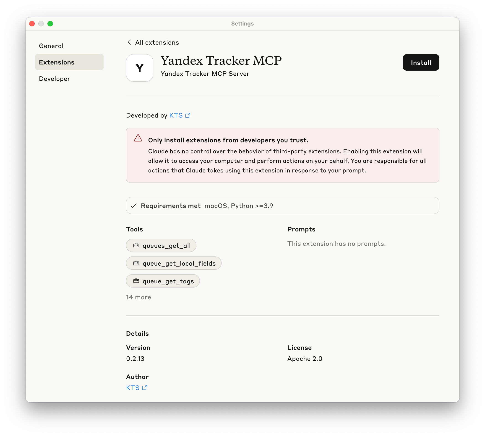
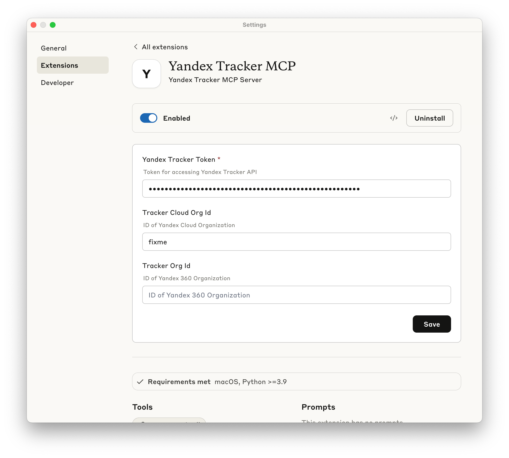

# Yandex Tracker MCP Server


mcp-name: io.github.aikts/yandex-tracker-mcp

Комплексный MCP (Model Context Protocol) сервер, который позволяет ИИ-ассистентам взаимодействовать с API Яндекс.Трекера. Этот сервер обеспечивает безопасный, аутентифицированный доступ к задачам, очередям, комментариям, трудозатратам и функциям поиска Яндекс.Трекера с опциональным Redis-кешированием для улучшения производительности.

<a href="https://glama.ai/mcp/servers/@aikts/yandex-tracker-mcp">
  
</a>

## Возможности

- **Полное управление очередями**: Список и доступ ко всем доступным очередям Яндекс.Трекера с поддержкой пагинации, получением тегов и подробными метаданными
- **Проекты, портфели и цели**: Отдельные инструменты чтения и записи с явными схемами для каждого типа сущности API "entities" Трекера (включаются через `TRACKER_ENTITIES_ENABLED`)
- **Управление пользователями**: Получение информации об учетных записях пользователей, включая данные для входа, адреса электронной почты, статус лицензии и данные организации
- **Полный жизненный цикл задач**: Создание, чтение, обновление и управление задачами с поддержкой пользовательских полей, вложений и переходов по рабочему процессу
- **Управление рабочим процессом**: Выполнение переходов статусов, закрытие задач с резолюциями и навигация по сложным рабочим процессам
- **Управление полями**: Доступ к глобальным полям, локальным полям очереди, статусам, типам задач, приоритетам и резолюциям
- **Расширенный язык запросов**: Полная поддержка языка запросов Яндекс.Трекера со сложной фильтрацией, сортировкой
- **Кеширование производительности**: Опциональный слой кеширования Redis для улучшения времени отклика
- **Контроль безопасности**: Настраиваемые ограничения доступа к очередям и безопасная обработка токенов
- **Несколько вариантов транспорта**: Поддержка stdio, SSE (устаревший) и HTTP транспортов для гибкой интеграции
- **OAuth 2.0 аутентификация**: Динамическая аутентификация на основе токенов с автоматическим обновлением в качестве альтернативы статическим API-токенам
- **Поддержка организаций**: Совместимость как со стандартными, так и с облачными идентификаторами организаций

### Конфигурация идентификатора организации

Выберите один из следующих вариантов в зависимости от типа вашей организации Яндекса:

- **Организация Yandex Cloud**: Используйте переменную окружения `TRACKER_CLOUD_ORG_ID` для организаций, управляемых Yandex Cloud
- **Организация Яндекс 360**: Используйте переменную окружения `TRACKER_ORG_ID` для организаций Яндекс 360

Вы можете найти идентификатор вашей организации в URL Яндекс.Трекера или в настройках организации.

## Конфигурация MCP клиента

### Установка расширения в Claude Desktop

Yandex Tracker MCP Server можно установить в один клик в Claude Desktop как [расширение](https://www.anthropic.com/engineering/desktop-extensions).

#### Установка

1. Скачайте файл `*.mcpb` из [GitHub Releases](https://github.com/aikts/yandex-tracker-mcp/releases/latest).
2. Откройте скачанный файл, чтобы установить его в Claude Desktop. 
3. Введите ваш OAuth токен Яндекс.Трекера при запросе. 
4. Убедитесь, что расширение включено - теперь вы можете использовать этот MCP сервер.

### Ручная установка

#### Предварительные требования

- [uv](https://docs.astral.sh/uv/getting-started/installation/) установлен глобально
- Действительный API токен Яндекс.Трекера с соответствующими разрешениями

Следующие разделы показывают, как настроить MCP сервер для различных MCP-клиентов. Вы можете использовать либо `uvx yandex-tracker-mcp@latest`, либо Docker-образ `ghcr.io/aikts/yandex-tracker-mcp:latest`. Оба требуют следующие переменные окружения:

- Аутентификация (один из следующих):
  - `TRACKER_TOKEN` - Ваш OAuth токен Яндекс.Трекера
  - `TRACKER_IAM_TOKEN` - Ваш IAM токен
  - `TRACKER_SA_KEY_ID`, `TRACKER_SA_SERVICE_ACCOUNT_ID`, `TRACKER_SA_PRIVATE_KEY` - Учетные данные сервисного аккаунта
- Организация - ровно одна из следующих переменных:
  - `TRACKER_CLOUD_ORG_ID` - Идентификатор вашей организации Yandex Cloud
  - `TRACKER_ORG_ID` - Идентификатор вашей организации Яндекс 360

> Задавайте **одну** из двух. Если заданы обе, любой вызов Трекера завершится ошибкой
> `Only one of org_id or cloud_org_id should be provided.` В примерах ниже используется
> `TRACKER_CLOUD_ORG_ID`; для Яндекс 360 замените этот ключ на `TRACKER_ORG_ID`.

<details>
<summary><strong>Claude Desktop</strong></summary>

**Путь к файлу конфигурации:**
- macOS: `~/Library/Application Support/Claude/claude_desktop_config.json`
- Windows: `%APPDATA%\Claude\claude_desktop_config.json`

**Используя uvx:**
```json
{
  "mcpServers": {
    "yandex-tracker": {
      "command": "uvx",
      "args": ["yandex-tracker-mcp@latest"],
      "env": {
        "TRACKER_TOKEN": "ваш_токен_трекера",
        "TRACKER_CLOUD_ORG_ID": "ваш_cloud_org_id"
      }
    }
  }
}
```

**Используя Docker:**
```json
{
  "mcpServers": {
    "yandex-tracker": {
      "command": "docker",
      "args": [
        "run", "--rm", "-i",
        "-e", "TRACKER_TOKEN",
        "-e", "TRACKER_CLOUD_ORG_ID",
        "ghcr.io/aikts/yandex-tracker-mcp:latest"
      ],
      "env": {
        "TRACKER_TOKEN": "ваш_токен_трекера",
        "TRACKER_CLOUD_ORG_ID": "ваш_cloud_org_id"
      }
    }
  }
}
```

</details>

<details>
<summary><strong>Claude Code</strong></summary>

**Используя uvx:**
```bash
claude mcp add yandex-tracker uvx yandex-tracker-mcp@latest \
  -e TRACKER_TOKEN=ваш_токен_трекера \
  -e TRACKER_CLOUD_ORG_ID=ваш_cloud_org_id \
  -e TRANSPORT=stdio
```

**Используя Docker:**
```bash
claude mcp add yandex-tracker docker "run --rm -i -e TRACKER_TOKEN=ваш_токен_трекера -e TRACKER_CLOUD_ORG_ID=ваш_cloud_org_id -e TRANSPORT=stdio ghcr.io/aikts/yandex-tracker-mcp:latest"
```

</details>

<details>
<summary><strong>Cursor</strong></summary>

**Путь к файлу конфигурации:**
- Для проекта: `.cursor/mcp.json` в директории вашего проекта
- Глобальный: `~/.cursor/mcp.json`

**Используя uvx:**
```json
{
  "mcpServers": {
    "yandex-tracker": {
      "command": "uvx",
      "args": ["yandex-tracker-mcp@latest"],
      "env": {
        "TRACKER_TOKEN": "ваш_токен_трекера",
        "TRACKER_CLOUD_ORG_ID": "ваш_cloud_org_id"
      }
    }
  }
}
```

**Используя Docker:**
```json
{
  "mcpServers": {
    "yandex-tracker": {
      "command": "docker",
      "args": [
        "run", "--rm", "-i",
        "-e", "TRACKER_TOKEN",
        "-e", "TRACKER_CLOUD_ORG_ID",
        "ghcr.io/aikts/yandex-tracker-mcp:latest"
      ],
      "env": {
        "TRACKER_TOKEN": "ваш_токен_трекера",
        "TRACKER_CLOUD_ORG_ID": "ваш_cloud_org_id"
      }
    }
  }
}
```

</details>

<details>
<summary><strong>Windsurf</strong></summary>

**Путь к файлу конфигурации:**
- `~/.codeium/windsurf/mcp_config.json`

Доступ через: Настройки Windsurf → вкладка Cascade → Model Context Protocol (MCP) Servers → "View raw config"

**Используя uvx:**
```json
{
  "mcpServers": {
    "yandex-tracker": {
      "command": "uvx",
      "args": ["yandex-tracker-mcp@latest"],
      "env": {
        "TRACKER_TOKEN": "ваш_токен_трекера",
        "TRACKER_CLOUD_ORG_ID": "ваш_cloud_org_id"
      }
    }
  }
}
```

**Используя Docker:**
```json
{
  "mcpServers": {
    "yandex-tracker": {
      "command": "docker",
      "args": [
        "run", "--rm", "-i",
        "-e", "TRACKER_TOKEN",
        "-e", "TRACKER_CLOUD_ORG_ID",
        "ghcr.io/aikts/yandex-tracker-mcp:latest"
      ],
      "env": {
        "TRACKER_TOKEN": "ваш_токен_трекера",
        "TRACKER_CLOUD_ORG_ID": "ваш_cloud_org_id"
      }
    }
  }
}
```

</details>

<details>
<summary><strong>Zed</strong></summary>

**Путь к файлу конфигурации:**
- `~/.config/zed/settings.json`

Доступ через: `Cmd+,` (macOS) или `Ctrl+,` (Linux/Windows) или палитра команд: "zed: open settings"

**Примечание:** Требуется версия Zed Preview для поддержки MCP.

**Используя uvx:**
```json
{
  "context_servers": {
    "yandex-tracker": {
      "source": "custom",
      "command": {
        "path": "uvx",
        "args": ["yandex-tracker-mcp@latest"],
        "env": {
          "TRACKER_TOKEN": "ваш_токен_трекера",
          "TRACKER_CLOUD_ORG_ID": "ваш_cloud_org_id"
        }
      }
    }
  }
}
```

**Используя Docker:**
```json
{
  "context_servers": {
    "yandex-tracker": {
      "source": "custom",
      "command": {
        "path": "docker",
        "args": [
          "run", "--rm", "-i",
          "-e", "TRACKER_TOKEN",
          "-e", "TRACKER_CLOUD_ORG_ID",
          "ghcr.io/aikts/yandex-tracker-mcp:latest"
        ],
        "env": {
          "TRACKER_TOKEN": "ваш_токен_трекера",
          "TRACKER_CLOUD_ORG_ID": "ваш_cloud_org_id"
        }
      }
    }
  }
}
```

</details>

<details>
<summary><strong>GitHub Copilot (VS Code)</strong></summary>

**Путь к файлу конфигурации:**
- Рабочее пространство: `.vscode/mcp.json` в директории вашего проекта
- Глобальный: VS Code `settings.json`

**Вариант 1: Конфигурация рабочего пространства (рекомендуется для безопасности)**

Создайте `.vscode/mcp.json`:

**Используя uvx:**
```json
{
  "inputs": [
    {
      "type": "promptString",
      "id": "tracker-token",
      "description": "Токен Яндекс.Трекера",
      "password": true
    },
    {
      "type": "promptString",
      "id": "cloud-org-id",
      "description": "Идентификатор организации Yandex Cloud"
    }
  ],
  "servers": {
    "yandex-tracker": {
      "type": "stdio",
      "command": "uvx",
      "args": ["yandex-tracker-mcp@latest"],
      "env": {
        "TRACKER_TOKEN": "${input:tracker-token}",
        "TRACKER_CLOUD_ORG_ID": "${input:cloud-org-id}",
        "TRANSPORT": "stdio"
      }
    }
  }
}
```

**Используя Docker:**
```json
{
  "inputs": [
    {
      "type": "promptString",
      "id": "tracker-token",
      "description": "Токен Яндекс.Трекера",
      "password": true
    },
    {
      "type": "promptString",
      "id": "cloud-org-id",
      "description": "Идентификатор организации Yandex Cloud"
    }
  ],
  "servers": {
    "yandex-tracker": {
      "type": "stdio",
      "command": "docker",
      "args": [
        "run", "--rm", "-i",
        "-e", "TRACKER_TOKEN",
        "-e", "TRACKER_CLOUD_ORG_ID",
        "ghcr.io/aikts/yandex-tracker-mcp:latest"
      ],
      "env": {
        "TRACKER_TOKEN": "${input:tracker-token}",
        "TRACKER_CLOUD_ORG_ID": "${input:cloud-org-id}",
        "TRANSPORT": "stdio"
      }
    }
  }
}
```

**Вариант 2: Глобальная конфигурация**

Добавьте в VS Code `settings.json`:

**Используя uvx:**
```json
{
  "github.copilot.chat.mcp.servers": {
    "yandex-tracker": {
      "type": "stdio",
      "command": "uvx",
      "args": ["yandex-tracker-mcp@latest"],
      "env": {
        "TRACKER_TOKEN": "ваш_токен_трекера",
        "TRACKER_CLOUD_ORG_ID": "ваш_cloud_org_id"
      }
    }
  }
}
```

**Используя Docker:**
```json
{
  "github.copilot.chat.mcp.servers": {
    "yandex-tracker": {
      "type": "stdio",
      "command": "docker",
      "args": [
        "run", "--rm", "-i",
        "-e", "TRACKER_TOKEN",
        "-e", "TRACKER_CLOUD_ORG_ID",
        "ghcr.io/aikts/yandex-tracker-mcp:latest"
      ],
      "env": {
        "TRACKER_TOKEN": "ваш_токен_трекера",
        "TRACKER_CLOUD_ORG_ID": "ваш_cloud_org_id"
      }
    }
  }
}
```

</details>

<details>
<summary><strong>Другие MCP-совместимые клиенты</strong></summary>

Для других MCP-совместимых клиентов используйте стандартный формат конфигурации MCP сервера:

**Используя uvx:**
```json
{
  "mcpServers": {
    "yandex-tracker": {
      "command": "uvx",
      "args": ["yandex-tracker-mcp@latest"],
      "env": {
        "TRACKER_TOKEN": "ваш_токен_трекера",
        "TRACKER_CLOUD_ORG_ID": "ваш_cloud_org_id"
      }
    }
  }
}
```

**Используя Docker:**
```json
{
  "mcpServers": {
    "yandex-tracker": {
      "command": "docker",
      "args": [
        "run", "--rm", "-i",
        "-e", "TRACKER_TOKEN",
        "-e", "TRACKER_CLOUD_ORG_ID",
        "ghcr.io/aikts/yandex-tracker-mcp:latest"
      ],
      "env": {
        "TRACKER_TOKEN": "ваш_токен_трекера",
        "TRACKER_CLOUD_ORG_ID": "ваш_cloud_org_id"
      }
    }
  }
}
```

</details>

**Важные замечания:**
- Замените значения на ваши реальные учетные данные
- Перезапустите ваш MCP-клиент после изменения конфигурации
- При использовании `uvx` убедитесь, что `uvx` установлен и доступен в вашем системном PATH
- Для production использования рассмотрите использование переменных окружения вместо жесткого кодирования токенов

## Доступные MCP инструменты

Сервер предоставляет следующие инструменты через протокол MCP:

<details>
<summary><strong>Управление очередями</strong></summary>

- **`queues_get_all`**: Список всех доступных очередей Яндекс.Трекера
  - Параметры:
    - `fields` (опционально): Поля для включения в ответ (например, ["key", "name"]). Помогает оптимизировать использование контекстного окна, выбирая только необходимые поля. Если не указано, возвращает все доступные поля.
    - `page` (опционально): Номер страницы для возврата. Если не указан, автоматически получает все страницы.
    - `per_page` (опционально): Количество элементов на страницу (по умолчанию: 100)
  - Возвращает `{values, hits, pages}`. `hits`/`pages` заполняются только для явно запрошенной одной страницы и только когда не задан `TRACKER_LIMIT_QUEUES`, поскольку итоги считают очереди, которые allow-list затем скрывает
  - Учитывает ограничения `TRACKER_LIMIT_QUEUES`

- **`queue_get_tags`**: Получить все теги для конкретной очереди
  - Параметры: `queue_id` (строка, ключ очереди, например "SOMEPROJECT")
  - Возвращает список доступных тегов в указанной очереди
  - Учитывает ограничения `TRACKER_LIMIT_QUEUES`

- **`queue_get_versions`**: Получить все версии для конкретной очереди
  - Параметры: `queue_id` (строка, ключ очереди, например "SOMEPROJECT")
  - Возвращает список доступных версий в указанной очереди с деталями, такими как имя, описание, даты и статус
  - Учитывает ограничения `TRACKER_LIMIT_QUEUES`

- **`queue_create_version`**: Создать новую версию в конкретной очереди
  - Параметры:
    - `queue_id` (строка, обязательно): Ключ очереди, например "SOMEPROJECT"
    - `name` (строка, обязательно): Название версии
    - `description` (строка, опционально): Описание версии
    - `start_date` (дата, опционально): Дата начала версии в формате `YYYY-MM-DD`
    - `due_date` (дата, опционально): Дата завершения версии в формате `YYYY-MM-DD`
  - Возвращает созданную версию с деталями, такими как имя, описание, даты и статус
  - Учитывает ограничения `TRACKER_LIMIT_QUEUES`

- **`queue_get_fields`**: Получить поля для конкретной очереди
  - Параметры:
    - `queue_id` (строка, обязательно): Ключ очереди, например "SOMEPROJECT"
    - `include_local_fields` (логическое, опционально, по умолчанию: true): Включать ли локальные поля очереди
  - Возвращает список глобальных полей и опционально локальных (специфичных для очереди) полей
  - Выполняет параллельные запросы для получения обоих типов полей когда `include_local_fields` равен true
  - Свойство `schema.required` указывает, является ли поле обязательным
  - Используйте для получения доступных и обязательных полей перед созданием задачи с помощью инструмента `issue_create`
  - Учитывает ограничения `TRACKER_LIMIT_QUEUES`

- **`queue_get_metadata`**: Получить подробные метаданные о конкретной очереди
  - Параметры:
    - `queue_id` (строка, обязательно): Ключ очереди, например "SOMEPROJECT"
    - `expand` (массив строк, опционально): Поля для расширения в ответе. Доступные опции: `all`, `projects`, `components`, `versions`, `types`, `team`, `workflows`, `fields`, `issueTypesConfig`
  - Возвращает информацию об очереди, включая название, описание, тип/приоритет по умолчанию и опционально расширенные данные
  - Используйте `expand: ["issueTypesConfig"]` для получения доступных резолюций для каждого типа задачи (необходимо для инструмента `issue_close`)
  - Учитывает ограничения `TRACKER_LIMIT_QUEUES`

</details>

<details>
<summary><strong>Проекты, портфели и цели</strong></summary>

Проекты, портфели и цели — это отдельные сущности Яндекс Трекера (отличные от очередей), доступные через API "entities" Трекера. У каждого типа сущности свой инструмент и явная схема; пользовательские (кастомные) атрибуты не моделируются и не возвращаются.

> **Эти инструменты включаются явно.** Они регистрируются только при `TRACKER_ENTITIES_ENABLED=true` (по умолчанию `false`), потому что заметно увеличивают манифест инструментов и не подчиняются ограничениям по очередям — см. [Управление доступом к очередям](#управление-доступом-к-очередям).

- **`project_get`**: Получить проект по id или shortId
  - Параметры:
    - `entity_id` (строка, обязательно): id или shortId проекта
    - `fields` (массив строк, опционально): Поля сущности для включения в ответ, ограниченные допустимыми значениями для данного типа сущности. По умолчанию используется базовый набор полей (`summary`, `description`, `entityStatus`, `start`, `end`, `lead`, `author`, `tags`; у целей `start` не запрашивается — API его для них не определяет)
  - Возвращает метаданные проекта (id, shortId, version, createdBy/createdAt/updatedAt) и запрошенные поля

- **`project_find`**: Поиск проектов по подстроке в названии и/или фильтрам полей
  - Параметры (все опциональны): `input` (поиск по подстроке), `filter` (карта критериев по полям), `order_by`, `order_asc`, `root_only` (исключить вложенные сущности), `page`, `per_page`, `fields`
  - Возвращает результат поиска с пагинацией (`hits`, `pages`, `values`)

- **`portfolio_get`** / **`portfolio_find`**: Аналогично `project_get` / `project_find`, но для портфелей (портфель объединяет проекты и/или другие портфели)

- **`goal_get`** / **`goal_find`**: Аналогично `project_get` / `project_find`, но для целей. У целей другой набор значений `entityStatus` (`draft`, `according_to_plan`, `at_risk`, `blocked`, `achieved`, `partially_achieved`, `not_achieved`, `exceeded`, `cancelled`)

- **`project_get_comments`**: Получить страницу комментариев проекта по его id или shortId
  - Параметры: `entity_id` (обязательно); `per_page` (опционально, по умолчанию 50); `cursor` (опционально, значение `next_cursor` из предыдущего вызова); `fields` (опционально, массив имён полей комментария — text/text_html могут быть большими, выбирайте только нужные; по умолчанию возвращаются все поля)
  - Возвращает `{comments, next_cursor}` (структура комментариев та же, что и у задач). Пагинация курсором: передавайте `next_cursor` как `cursor`, пока он не станет null
- **`portfolio_get_comments`** / **`goal_get_comments`**: Аналогично `project_get_comments`, но для портфелей и целей

Инструменты записи (`project_create`/`project_update`/`project_delete` и аналогичные `portfolio_*` / `goal_*`) также доступны и регистрируются, только если установлен `TRACKER_ENTITIES_ENABLED` и не установлен `TRACKER_READ_ONLY`:

- **`project_create`**: Создать проект. Требуется `summary`. Также принимает `description`, `lead`, `team_users`, `clients`, `followers`, `start`, `end`, `tags`, `entity_status`, `parent_entity`, `team_access` и `links`
- **`project_update`**: Изменить любое из перечисленных полей существующего проекта. Принимает опциональные `comment` и `version` (для обнаружения конфликтов через оптимистичную блокировку). Переданный `links` **добавляет** связи, а не заменяет их — повторная отправка существующей связи завершается ошибкой. В API Трекера связи доступны только на запись (`links` не входит в допустимые значения `fields` и не возвращается ни get, ни update), поэтому прочитать текущий набор нельзя, а удалить связь через сервер невозможно. Кроме того, Трекер игнорирует апдейт, в котором меняются только связи, поэтому `links` нужно передавать вместе с изменением поля или с `comment`; сервер отклоняет такой вызов вместо того, чтобы отчитаться об успехе (всё проверено на живом API)
- **`project_delete`**: Удалить проект. Принимает опциональный флаг `with_board` для удаления связанной доски
- **`portfolio_create`** / **`portfolio_update`** / **`portfolio_delete`**: Аналогично инструментам записи для проектов
- **`goal_create`** / **`goal_update`** / **`goal_delete`**: Аналогично инструментам записи для портфелей, но без `start` и со своими наборами значений `entityStatus` и типов связей. У `goal_delete` нет флага `with_board` — у целей нет досок

Все инструменты создания/изменения принимают тот же селектор `fields`, что и инструменты чтения, и возвращают созданную/изменённую сущность с заполненными полями.

- **`project_add_comment`**: Добавить комментарий к проекту. Требуется `entity_id` и `text` (поддерживается Markdown/YFM). Принимает опциональные `summonees` (логины/ID пользователей для уведомления — используйте вместо '@login' в тексте) и `maillist_summonees` (email рассылок)
- **`project_update_comment`**: Изменить существующий комментарий. Требуется `entity_id`, `comment_id` и `text`. Принимает те же опциональные `summonees` / `maillist_summonees`
- **`project_delete_comment`**: Удалить комментарий. Требуется `entity_id` и `comment_id`
- **`portfolio_add_comment`** / **`portfolio_update_comment`** / **`portfolio_delete_comment`** и **`goal_add_comment`** / **`goal_update_comment`** / **`goal_delete_comment`**: Аналогично инструментам записи комментариев для проектов, но для портфелей и целей

Для проектов и портфелей (но не целей — API Яндекс Трекера не поддерживает чек-листы для целей) также доступны инструменты записи чек-листов. Все они возвращают полную обновлённую сущность (запросите `checklistItems` через `fields`, чтобы увидеть текущие элементы):

- **`project_add_checklist_item`**: Добавить элемент чек-листа. Требуется `entity_id` и `text`. Принимает опциональные `checked`, `assignee` (ID/логин пользователя) и `deadline` (например, `{'date': '2026-08-20T00:00:00.000+0000', 'deadlineType': 'date'}`)
- **`project_update_checklist_item`**: Частично изменить элемент чек-листа. Требуется `entity_id` и `checklist_item_id`; остальные поля (`text`, `checked`, `assignee`, `deadline`) опциональны и меняют только то, что передано
- **`project_move_checklist_item`**: Переместить элемент чек-листа. Требуется `entity_id`, `checklist_item_id` и `before` (id элемента, перед которым нужно вставить)
- **`project_delete_checklist_item`**: Удалить один элемент чек-листа. Требуется `entity_id` и `checklist_item_id`
- **`project_update_checklist`**: Изменить один или несколько существующих пунктов чек-листа по id. Требуется `entity_id` и `items` (объекты `{id, text, checked?, assignee?, deadline?}`). Меняются только перечисленные пункты — сервер сам подгружает текущий чек-лист и досылает остальные пункты как есть, обходя ограничение API, которое отклоняет неполный список с ошибкой 500 (проверено на живом API). Для изменения состава используйте инструменты добавления/удаления пункта
- **`project_delete_checklist`**: Удалить весь чек-лист. Требуется `entity_id`
- **`portfolio_add_checklist_item`** / **`portfolio_update_checklist_item`** / **`portfolio_move_checklist_item`** / **`portfolio_delete_checklist_item`** / **`portfolio_update_checklist`** / **`portfolio_delete_checklist`**: Аналогично инструментам записи чек-листов для проектов, но для портфелей

Метрики (`metricItems`, есть у всех трёх типов сущностей) и ключевые результаты цели (`keyResultItems`) доступны на чтение через селектор `fields` — их нужно запрашивать явно, в набор по умолчанию они не входят. Запись не поддерживается: в справочнике API не описано, заменяет ли обновление эти коллекции целиком или дополняет их.

Пока не поддерживается: запись метрик и ключевых результатов, а также массовые изменения — это запланировано на будущее.

</details>

<details>
<summary><strong>Управление пользователями</strong></summary>

- **`users_get_all`**: Получить информацию об учетных записях пользователей, зарегистрированных в организации
  - Параметры:
    - `per_page` (опционально): Количество пользователей на страницу (по умолчанию: 50)
    - `page` (опционально): Номер страницы для возврата (по умолчанию: 1)
    - `fields` (массив строк, опционально): Поля для включения по каждому пользователю. Если не указано - возвращаются все доступные поля
  - Возвращает `{values, hits, pages}`: страницу пользователей плюс сколько их всего и сколько это страниц
  - Включает метаданные пользователя, такие как внешний статус, статус увольнения и настройки уведомлений
  - Текущая страница последняя, когда `page` равен `pages`

- **`user_get`**: Получить информацию о конкретном пользователе по логину или UID
  - Параметры: `user_id` (строка, логин пользователя, например "john.doe" или UID, например "12345")
  - Возвращает подробную информацию о пользователе, включая логин, электронную почту, статус лицензии и организационные детали
  - Поддерживает как имена входа пользователя, так и числовые идентификаторы пользователей для гибкой идентификации

- **`user_get_current`**: Получить информацию о текущем аутентифицированном пользователе
  - Параметры не требуются
  - Возвращает подробную информацию о пользователе, связанном с текущим токеном аутентификации
  - Включает логин, электронную почту, отображаемое имя и организационные детали для аутентифицированного пользователя

- **`users_search`**: Поиск пользователя по логину, электронной почте или реальному имени (имя или фамилия, или оба)
  - Параметры: `login_or_email_or_name` (строка, логин пользователя, электронная почта или реальное имя для поиска)
  - Возвращает одного пользователя или нескольких пользователей, если несколько совпадают с запросом, или пустой список, если ни один пользователь не соответствует
  - Использует нечеткое сопоставление для реальных имен с порогом сходства 80% и возвращает не более 3 лучших совпадений
  - Приоритизирует точные совпадения для логина и электронной почты перед нечеткими совпадениями имен

</details>

<details>
<summary><strong>Управление полями</strong></summary>

- **`get_global_fields`**: Получить все глобальные поля, доступные в Яндекс.Трекере
  - Возвращает полный список глобальных полей, которые можно использовать в задачах
  - Включает схему полей, информацию о типах и конфигурацию

</details>

<details>
<summary><strong>Управление статусами и типами</strong></summary>

- **`get_statuses`**: Получить все доступные статусы задач
  - Возвращает полный список статусов задач, которые могут быть назначены
  - Включает идентификаторы статусов, имена и информацию о типах

- **`get_issue_types`**: Получить все доступные типы задач
  - Возвращает полный список типов задач для создания/обновления задач
  - Включает идентификаторы типов, имена и детали конфигурации

- **`get_priorities`**: Получить все доступные приоритеты задач
  - Возвращает полный список приоритетов, которые могут быть назначены задачам
  - Включает ключи приоритетов, имена и информацию о порядке

- **`get_resolutions`**: Получить все доступные резолюции задач
  - Возвращает полный список резолюций, которые могут быть использованы при закрытии задач
  - Включает ключи резолюций, имена, описания и информацию о порядке

</details>

<details>
<summary><strong>Шаблоны</strong></summary>

- **`issue_templates_get_all`**: Получить все шаблоны задач, настроенные в Яндекс Трекере
  - Параметры:
    - `queue` (строка, опционально): Вернуть только шаблоны, применимые в этой очереди - её собственные плюс шаблоны без очереди
    - `page` (целое, опционально): Номер страницы, по умолчанию возвращаются все страницы
    - `per_page` (целое, опционально): Количество элементов на странице (по умолчанию: 50)
  - Возвращает `{values, hits, pages}`; в `values` - шаблоны, которые команды используют для багов, инцидентов и другой типовой работы
  - Включает идентификатор шаблона, имя, очередь и значения `fieldTemplates`, которые шаблон подставляет в поля задачи

- **`issue_template_get`**: Получить один шаблон задачи по его идентификатору
  - Параметры:
    - `template_id` (строка): Идентификатор шаблона из результата `issue_templates_get_all`
  - Используйте перед `issue_create`, чтобы новая задача соответствовала актуальному шаблону команды, а не выдуманной структуре

- **`comment_templates_get_all`**: Получить все шаблоны комментариев, настроенные в Яндекс Трекере
  - Параметры:
    - `queue` (строка, опционально): Вернуть только шаблоны, применимые в этой очереди - её собственные плюс шаблоны без очереди
    - `page` (целое, опционально): Номер страницы, по умолчанию возвращаются все страницы
    - `per_page` (целое, опционально): Количество элементов на странице (по умолчанию: 50)
  - Возвращает `{values, hits, pages}`; в `values` - формулировки, которые команды переиспользуют при ответах в задачах
  - Включает идентификатор шаблона, имя, описание, очередь, текст комментария `template` и списки призываемых `summonees` / `maillistSummonees`

- **`comment_template_get`**: Получить один шаблон комментария по его идентификатору
  - Параметры:
    - `template_id` (строка): Идентификатор шаблона из результата `comment_templates_get_all`
  - Используйте перед `issue_add_comment`, чтобы комментарий соответствовал актуальному шаблону команды

Оба списка постранично разбиваются API (50 шаблонов на страницу), поэтому по умолчанию инструменты проходят все страницы и возвращают полный набор; передайте `page`, чтобы получить одну страницу при ограниченном контексте. Как и у `queues_get_all`, `hits`/`pages` заполняются только для явно запрошенной одной страницы и только когда не задан `TRACKER_LIMIT_QUEUES`: полный обход и так вернул всё, что есть, а итоги считают шаблоны, которые allow-list затем скрывает.

Шаблоны доступны только на чтение: в API Трекера нет способа создать задачу или комментарий *из* шаблона, поэтому у `issue_create` и `issue_add_comment` нет параметра `template_id`. Сначала прочитайте шаблон и передайте его значения в аргументы инструмента.

Все четыре инструмента учитывают `TRACKER_LIMIT_QUEUES`: шаблоны запрещённых очередей исключаются из списков и отклоняются при прямом обращении, шаблоны без очереди остаются доступными. Запрещённая очередь в параметре `queue` также отклоняется.

</details>

<details>
<summary><strong>Операции с задачами</strong></summary>

- **`issue_get`**: Прочитать одну задачу (тикет, баг) по её ключу/ID
  - Параметры:
    - `issue_id` (строка, формат: "QUEUE-123")
    - `include_description` (логический, опционально, по умолчанию: true): Включать ли описание задачи в результат. Может быть большим, поэтому используйте только при необходимости.
  - Возвращает полную запись задачи: название, описание, статус, тип, приоритет, исполнителя, автора, теги, компоненты, спринт, эпик, родителя, дедлайн, дату начала, story points, оценку, затраченное время, голоса, даты и авторов создания/изменения, текущую `version`, а также локальные для очереди и пользовательские поля
  - Вызывайте его непосредственно перед `issue_update`, чтобы получить свежую `version` для оптимистичной блокировки; используйте `issues_find`, когда ключ неизвестен
  - Комментарии, связи, вложения, ворклоги, чек-лист, история изменений и переходы **не** входят в ответ - для них есть отдельные инструменты `issue_get_*`

- **`issue_get_url`**: Сгенерировать веб-URL для задачи
  - Параметры: `issue_id` (строка)
  - Возвращает: `https://tracker.yandex.ru/{issue_id}`

- **`issue_get_comments`**: Получить страницу комментариев задачи
  - Параметры:
    - `issue_id` (строка)
    - `per_page` (опционально, по умолчанию 50), `cursor` (опционально, значение `next_cursor` из предыдущего вызова)
    - `fields` (массив строк, опционально): Поля для включения по каждому комментарию (text/text_html могут быть большими). Если не указано - возвращаются все доступные поля
  - Возвращает `{comments, next_cursor}` — комментарии в хронологическом порядке с метаданными. Пагинация курсором: передавайте `next_cursor` как `cursor`, пока он не станет null

- **`issue_add_comment`**: Добавить комментарий к задаче
  - Параметры:
    - `issue_id` (строка, обязательно, формат: "QUEUE-123")
    - `text` (строка, обязательно): Текст комментария (Трекер поддерживает markdown)
    - `summonees` (массив строк, опционально): Кого призвать (логины или ID). **Это и есть “упоминание/призыв”** — уведомления уходят именно по этому параметру (не по `@login` в тексте).
    - `maillist_summonees` (массив строк, опционально): Почтовые рассылки (emails)
    - `markup_type` (строка, опционально): Для YFM-разметки укажите `md`
    - `is_add_to_followers` (логический, опционально, по умолчанию: true): Добавлять автора комментария в наблюдатели
  - Возвращает созданный комментарий

- **`issue_update_comment`**: Изменить комментарий в задаче
  - Параметры:
    - `issue_id` (строка, обязательно, формат: "QUEUE-123")
    - `comment_id` (число, обязательно): ID комментария
    - `text` (строка, обязательно): Новый текст комментария (Трекер поддерживает markdown)
    - `summonees` (массив строк, опционально): Кого призвать (логины или ID)
    - `maillist_summonees` (массив строк, опционально): Почтовые рассылки (emails)
    - `markup_type` (строка, опционально): Для YFM-разметки укажите `md`
  - Возвращает обновлённый комментарий

- **`issue_delete_comment`**: Удалить комментарий из задачи
  - Параметры:
    - `issue_id` (строка, обязательно, формат: "QUEUE-123")
    - `comment_id` (число, обязательно): ID комментария
  - Возвращает: `null` (успех)

- **`issue_add_link`**: Создать связь задачи с другой задачей
  - Параметры:
    - `issue_id` (строка, обязательно, формат: "QUEUE-123"): Текущая задача
    - `relationship` (строка, обязательно): Тип связи, описывающий отношение `issue_id` к связываемой задаче. Одно из: `relates`, `is dependent by`, `depends on`, `is subtask for`, `is parent task for`, `duplicates`, `is duplicated by`, `is epic of`, `has epic`
    - `issue` (строка, обязательно): ID или ключ связываемой задачи (например, "TEST-123")
  - Возвращает созданную связь

- **`issue_delete_link`**: Удалить связь задачи с другой задачей
  - Параметры:
    - `issue_id` (строка, обязательно, формат: "QUEUE-123")
    - `link_id` (число, обязательно): ID связи (как возвращает `issue_get_links`)
  - Возвращает: `null` (успех)

- **`issue_get_links`**: Получить связанные ссылки задачи
  - Параметры: `issue_id` (строка)
  - Возвращает ссылки на связанные, заблокированные или дублирующие задачи

- **`issue_get_worklogs`**: Получить записи трудозатрат
  - Параметры:
    - `issue_ids` (массив строк)
    - `fields` (массив строк, опционально): Поля для включения по каждой записи трудозатрат. Если не указано - возвращаются все доступные поля
  - Возвращает данные учета времени для указанных задач

- **`issue_add_worklog`**: Списать время (добавить worklog) в задачу
  - Параметры:
    - `issue_id` (строка, обязательно, формат: "QUEUE-123")
    - `duration` (строка, обязательно): ISO-8601 длительность (например, `PT1H30M`)
    - `comment` (строка, опционально): Комментарий к записи трудозатрат
    - `start` (datetime, опционально): Время начала работ (если таймзона не указана — считается UTC)
  - Возвращает созданную запись трудозатрат

- **`issue_update_worklog`**: Обновить запись трудозатрат (worklog) в задаче
  - Параметры:
    - `issue_id` (строка, обязательно, формат: "QUEUE-123")
    - `worklog_id` (число, обязательно): ID записи трудозатрат
    - `duration` (строка, опционально): ISO-8601 длительность (например, `PT1H30M`)
    - `comment` (строка, опционально): Комментарий к записи трудозатрат
    - `start` (datetime, опционально): Время начала работ (если таймзона не указана — считается UTC)
  - Возвращает обновлённую запись трудозатрат

- **`issue_delete_worklog`**: Удалить запись трудозатрат (worklog) из задачи
  - Параметры:
    - `issue_id` (строка, обязательно, формат: "QUEUE-123")
    - `worklog_id` (число, обязательно): ID записи трудозатрат
  - Возвращает: `null` (успех)

- **`issue_get_attachments`**: Получить вложения для задачи
  - Параметры:
    - `issue_id` (строка, формат: "QUEUE-123")
    - `fields` (массив строк, опционально): Поля для включения по каждому вложению (поле `content` может быть большим). Если не указано - возвращаются все доступные поля
  - Возвращает список вложений с метаданными для указанной задачи

- **`issue_get_checklist`**: Получить элементы чек-листа задачи
  - Параметры: `issue_id` (строка, формат: "QUEUE-123")
  - Возвращает список элементов чек-листа, включая текст, статус, исполнителя и информацию о сроках

- **`issue_get_transitions`**: Получить возможные переходы статуса для задачи
  - Параметры: `issue_id` (строка, формат: "QUEUE-123")
  - Возвращает список доступных переходов, которые можно выполнить для задачи
  - Каждый переход включает ID, отображаемое имя и информацию о целевом статусе

- **`issue_get_changelog`**: Получить историю изменений (changelog) задачи
  - Параметры:
    - `issue_id` (строка, обязательно, формат: "QUEUE-123"): Ключ задачи
    - `per_page` (целое, опционально, по умолчанию: 50): Количество записей на странице
    - `cursor` (строка, опционально): Значение `next_cursor` из предыдущего вызова; передайте его для получения следующей страницы (курсорная пагинация)
    - `field` (строка, опционально): Фильтр истории по ключу поля (например, `status`)
    - `type` (строка, опционально): Фильтр по типу изменения (например, `IssueWorkflow` для переходов статуса)
  - Возвращает объект с `entries` (переходы статусов и правки полей — включая кто, что изменил `from` → `to` и когда — а также изменения комментариев и сработавшие триггеры) и `next_cursor` (передайте обратно как `cursor` для следующей страницы; `null`, когда страниц больше нет)

- **`issue_execute_transition`**: Выполнить переход статуса для задачи
  - Параметры:
    - `issue_id` (строка, обязательно, формат: "QUEUE-123"): Ключ задачи
    - `transition_id` (строка, обязательно): ID перехода для выполнения. **ВАЖНО**: Должен быть одним из ID, возвращенных инструментом `issue_get_transitions`
    - `comment` (строка, опционально): Опциональный комментарий для добавления при выполнении перехода
    - `fields` (объект, опционально): Словарь дополнительных полей для установки во время перехода. Распространенные поля включают `resolution` (например, 'fixed', 'wontFix') для закрытия задач, `assignee` для переназначения и т.д.
  - Возвращает список доступных переходов для нового статуса после выполнения перехода
  - **Примечание по использованию**: Вы ДОЛЖНЫ сначала вызвать `issue_get_transitions` для получения доступных переходов, затем передать один из возвращенных ID переходов. НЕ используйте произвольные ID переходов.

- **`issue_close`**: Закрыть задачу с резолюцией (удобный инструмент)
  - Параметры:
    - `issue_id` (строка, обязательно, формат: "QUEUE-123"): Ключ задачи
    - `resolution_id` (строка, обязательно): ID резолюции для установки при закрытии (например, 'fixed', 'wontFix', 'duplicate')
    - `comment` (строка, опционально): Опциональный комментарий для добавления при закрытии задачи
    - `fields` (объект, опционально): Словарь дополнительных полей, устанавливаемых при переходе закрытия (например, `assignee` для переназначения). НЕ задавайте здесь `resolution` - для этого есть отдельный параметр `resolution_id`
  - Автоматически находит переход к статусу 'done' и выполняет его с указанной резолюцией
  - Возвращает список доступных переходов для нового (закрытого) статуса
  - **Примечание по использованию**: Перед закрытием вы ДОЛЖНЫ:
    1. Вызвать `issue_get` для получения поля `type` задачи
    2. Вызвать `queue_get_metadata` с `expand: ["issueTypesConfig"]` для получения доступных резолюций
    3. Выбрать резолюцию из записи `issueTypesConfig`, соответствующей типу задачи - каждый тип задачи имеет свой набор допустимых резолюций

- **`issue_create`**: Создать новую задачу в очереди
  - Параметры:
    - `queue` (строка, обязательно): Ключ очереди для создания задачи (например, 'MYQUEUE')
    - `summary` (строка, обязательно): Название/краткое описание задачи
    - `type` (IssueTypeRef, строка или число, опционально): Тип задачи с `id` и/или `key`, либо просто ключ/ID (из инструмента `get_issue_types`)
    - `description` (строка, опционально): Описание задачи (используйте markdown-разметку)
    - `markup_type` (строка, опционально, по умолчанию `md`): Тип разметки для текста описания (используйте 'md' для YFM разметки)
    - `assignee` (строка или число, опционально): Логин или UID исполнителя
    - `priority` (IssuePriorityRef, строка или число, опционально): Приоритет с `id` и/или `key`, либо просто ключ/ID (из инструмента `get_priorities`)
    - `parent` (IssueParentRef или строка, опционально): Ссылка на родительскую задачу с `id` и/или `key` (например, 'QUEUE-123'), либо просто ключ
    - `sprint` (массив IssueSprintRef, опционально): Назначения спринтов - массив объектов с полем `id` (число)
    - `followers` (массив IssueFollowerRef, опционально): Наблюдатели - массив объектов с `id` (UID или логин пользователя)
    - `components` (массив IssueComponentRef, опционально): Компоненты очереди - массив объектов либо с `id` (числовой ID компонента), либо с `name` (название компонента)
    - `tags` (массив строк, опционально): Теги задачи
    - `project` (IssueProjectRef, опционально): Проект с `primary` (число, shortId основного проекта) и опциональным `secondary` (массив чисел)
    - `fields` (объект, опционально): Дополнительные поля, для которых нет отдельного параметра. **ВАЖНО**: Перед созданием задачи вы ДОЛЖНЫ вызвать `queue_get_fields` для получения доступных полей (по умолчанию возвращает как глобальные, так и локальные поля). Поля с `schema.required=true` являются обязательными. Используйте свойство `id` поля в качестве ключа в этом объекте (например, `{"fieldId": "value"}`). Значения передаются в Трекер как есть
  - Возвращает объект новой созданной задачи со всеми стандартными полями задачи
  - Принимает те же форматы значений, что и `issue_update`, поэтому значение ссылочного поля, работающее там, работает и здесь
  - **Про версию**: возвращённая `version` может устареть сразу же - триггеры очереди и автоматизация срабатывают сразу после создания и увеличивают её. Не передавайте её в последующий `issue_update`: перечитайте задачу через `issue_get` или не указывайте `version`
  - Учитывает ограничения `TRACKER_LIMIT_QUEUES`

- **`issue_update`**: Обновить существующую задачу
  - Параметры:
    - `issue_id` (строка, обязательно, формат: "QUEUE-123"): Ключ задачи для обновления
    - `summary` (строка, опционально): Новое название задачи
    - `description` (строка, опционально): Новое описание задачи
    - `markup_type` (строка, опционально): Тип разметки для текста описания (используйте 'md' для YFM разметки)
    - `parent` (IssueParentRef или строка, опционально): Ссылка на родительскую задачу с `id` (строка) и/или `key` (строка, например, 'QUEUE-123'), либо просто ключ
    - `sprint` (массив IssueSprintRef, опционально): Назначения спринтов - массив объектов с полем `id` (число)
    - `type` (IssueTypeRef, строка или число, опционально): Тип задачи с `id` (строка) и/или `key` (строка, например, 'bug', 'task'), либо просто ключ/ID
    - `priority` (IssuePriorityRef, строка или число, опционально): Приоритет с `id` (строка) и/или `key` (строка, например, 'critical', 'normal'), либо просто ключ/ID
    - `assignee` (строка или число, опционально): Новый логин или UID исполнителя
    - `followers` (массив IssueFollowerRef, опционально): Наблюдатели - массив объектов с `id` (UID или логин пользователя); заменяет текущий список
    - `components` (массив IssueComponentRef, опционально): Компоненты очереди - массив объектов либо с `id` (числовой ID компонента), либо с `name` (название компонента); заменяет текущий список
    - `project` (IssueProjectRef, опционально): Проект с `primary` (число, shortId основного проекта) и опциональным `secondary` (массив чисел)
    - `tags` (массив строк, опционально): Теги задачи
    - `version` (число, опционально): Версия задачи для оптимистичной блокировки - изменения применяются, только если это текущая версия задачи
    - `fields` (объект, опционально): Дополнительные поля, для которых нет отдельного параметра. Используйте `queue_get_fields` для получения доступных полей. Значения передаются в Трекер как есть
  - Возвращает обновленный объект задачи со всеми стандартными полями
  - Обновляются только предоставленные поля; непереданные поля остаются без изменений
  - **Про версию**: читайте `version` через `issue_get` непосредственно перед обновлением или не указывайте её, чтобы обновить актуальную версию. Устаревшая версия приводит к конфликту редактирования - его легко получить с версией из `issue_create`, потому что триггеры очереди её увеличивают
  - Учитывает ограничения `TRACKER_LIMIT_QUEUES`

- **`issue_move`**: Перенести задачу в другую очередь
  - Параметры:
    - `issue_id` (строка, обязательно, формат: "QUEUE-123"): Ключ задачи для переноса
    - `queue` (строка, обязательно): Ключ целевой очереди (например, 'MYQUEUE')
    - `notify` (логический, необязательно, по умолчанию `true`): Уведомлять пользователей, указанных в полях задачи
    - `notify_author` (логический, необязательно, по умолчанию `false`): Уведомлять автора задачи
    - `move_all_fields` (логический, необязательно, по умолчанию `false`): Перенести версии, компоненты и проекты, если соответствующие существуют в новой очереди; иначе они очищаются
    - `initial_status` (логический, необязательно, по умолчанию `false`): Сбросить статус задачи в начальное значение (используйте при переносе в очередь с другим рабочим процессом)
  - Возвращает обновлённый объект задачи с новым ключом в целевой очереди (например, `TASKS-1` → `NEWQUEUE-42`)
  - Если MCP-клиент поддерживает elicitation, перед выполнением переноса пользователю предлагается подтвердить логические флаги; отказ или отмена прерывают перенос. Клиенты без поддержки elicitation используют переданные значения
  - Учитывает ограничения `TRACKER_LIMIT_QUEUES`

</details>

<details>
<summary><strong>Поиск и обнаружение</strong></summary>

- **`issues_find`**: Поиск задач с использованием [языка запросов Яндекс.Трекера](https://yandex.ru/support/tracker/ru/user/query-filter)
  - Параметры:
    - `query` (обязательно): Строка запроса с использованием синтаксиса языка запросов Яндекс.Трекера
    - `include_description` (логический, опционально, по умолчанию: false): Включать ли описание задачи в результат задач. Может быть большим, поэтому используйте только при необходимости. Игнорируется, если `description` указан в `fields` - это явный запрос описания.
    - `fields` (список строк, опционально): Поля для ответа, в написании самого Трекера (`storyPoints`, а не `story_points`). Принимается любое имя поля, включая локальные поля очереди и кастомные поля организации - передавайте `id` поля из `queue_get_fields`. Неизвестное Трекеру имя молча отбрасывается. Если не указано, возвращает все доступные поля.
    - `page` (опционально): Номер страницы для пагинации (по умолчанию: 1)
    - `per_page` (опционально): Количество элементов на страницу (по умолчанию: 100). Может быть уменьшено, если результаты превышают контекстное окно.
  - Возвращает `{values, hits, pages}`: страницу задач плюс сколько задач найдено всего и сколько это страниц

- **`issues_count`**: Подсчет задач, соответствующих запросу с использованием [языка запросов Яндекс.Трекера](https://yandex.ru/support/tracker/ru/user/query-filter)
  - Параметры:
    - `query` (обязательно): Строка запроса с использованием синтаксиса языка запросов Яндекс.Трекера
  - Возвращает `{"count": N}` - количество задач, соответствующих указанным критериям
  - Поддерживает все функции языка запросов: фильтрация полей, функции дат, логические операторы и сложные выражения
  - Полезно для аналитики, отчетности и понимания распределения задач без получения полных данных задач

</details>

## Транспорт http

MCP сервер также может работать в режиме streamable-http для веб-интеграций или когда транспорт stdio не подходит.

### Переменные окружения режима streamable-http

```env
# Обязательно - Установить транспорт в режим streamable-http
TRANSPORT=streamable-http

# Конфигурация сервера
HOST=0.0.0.0  # По умолчанию: 0.0.0.0 (все интерфейсы)
PORT=8000     # По умолчанию: 8000
```

### Запуск streamable-http сервера

```bash
# Базовый запуск streamable-http сервера
TRANSPORT=streamable-http uvx yandex-tracker-mcp@latest

# С пользовательским хостом и портом
TRANSPORT=streamable-http \
HOST=localhost \
PORT=9000 \
uvx yandex-tracker-mcp@latest

# Со всеми переменными окружения
TRANSPORT=streamable-http \
HOST=0.0.0.0 \
PORT=8000 \
TRACKER_TOKEN=ваш_токен \
TRACKER_CLOUD_ORG_ID=ваш_org_id \
uvx yandex-tracker-mcp@latest
```

Вы можете пропустить настройку `TRACKER_CLOUD_ORG_ID` или `TRACKER_ORG_ID`, если используете следующий формат при подключении к MCP серверу (пример для Claude Code):

```bash
claude mcp add --transport http yandex-tracker "http://localhost:8000/mcp/?cloudOrgId=ваш_cloud_org_id&"
```

или

```bash
claude mcp add --transport http yandex-tracker "http://localhost:8000/mcp/?orgId=org_id&"
```

Вы также можете пропустить настройку глобальной переменной окружения `TRACKER_TOKEN`, если выберете использование OAuth 2.0 аутентификации (см. ниже).

### OAuth 2.0 аутентификация

Yandex Tracker MCP Server поддерживает OAuth 2.0 аутентификацию как безопасную альтернативу статическим API токенам. При настройке сервер выступает в качестве OAuth провайдера, облегчая аутентификацию между вашим MCP клиентом и сервисами Яндекс OAuth.

#### Как работает OAuth

MCP сервер реализует стандартный поток кода авторизации OAuth 2.0:

1. **Регистрация клиента**: Ваш MCP клиент регистрируется на сервере для получения учетных данных клиента
2. **Авторизация**: Пользователи перенаправляются в Яндекс OAuth для аутентификации
3. **Обмен токенами**: Сервер обменивает коды авторизации на токены доступа
4. **Доступ к API**: Клиенты используют bearer токены для всех запросов API
5. **Обновление токенов**: Истекшие токены можно обновить без повторной аутентификации

```
MCP Клиент → MCP Сервер → Яндекс OAuth → Аутентификация пользователя
    ↑                                           ↓
    └────────── Токен доступа ←─────────────────┘
```

#### Конфигурация OAuth

Для включения OAuth аутентификации установите следующие переменные окружения:

```env
# Включить режим OAuth
OAUTH_ENABLED=true

# Учетные данные приложения Яндекс OAuth (обязательно для OAuth)
OAUTH_CLIENT_ID=ваш_id_приложения_яндекс_oauth
OAUTH_CLIENT_SECRET=ваш_секрет_яндекс_oauth

# Публичный URL вашего MCP сервера (обязательно для OAuth обратных вызовов)
MCP_SERVER_PUBLIC_URL=https://ваш-mcp-сервер.example.com

# Опциональные настройки OAuth
OAUTH_SERVER_URL=https://oauth.yandex.ru  # OAuth сервер Яндекса по умолчанию

# Когда OAuth включен, TRACKER_TOKEN становится опциональным
```

##### OAuth scopes

При `OAUTH_USE_SCOPES=true` (по умолчанию) сервер запрашивает, публикует и требует scope'ы Яндекс
Трекера `tracker:read` и `tracker:write` - либо только `tracker:read`, если задан
`TRACKER_READ_ONLY=true`, чтобы read-only инстанс никогда не просил у пользователя доступ на запись.
`OAUTH_USE_SCOPES=false` полностью убирает scope'ы из потока - это требуется для федерации
Yandex Cloud.

#### Настройка приложения Яндекс OAuth

1. Перейдите на [Яндекс OAuth](https://oauth.yandex.ru/) и создайте новое приложение
2. Установите callback URL: `{MCP_SERVER_PUBLIC_URL}/oauth/yandex/callback`
3. Запросите следующие разрешения:
   - `tracker:read` - Разрешения на чтение для Трекера
   - `tracker:write` - Разрешения на запись для Трекера
4. Сохраните ваш Client ID и Client Secret

#### OAuth против аутентификации статическим токеном

| Функция               | OAuth                                   | Статический токен               |
|-----------------------|-----------------------------------------|---------------------------------|
| Безопасность          | Динамические токены с истечением        | Долгоживущие статические токены |
| Пользовательский опыт | Интерактивный поток входа               | Однократная настройка           |
| Управление токенами   | Автоматическое обновление               | Ручная ротация                  |
| Контроль доступа      | Аутентификация для каждого пользователя | Общий токен                     |
| Сложность настройки   | Требует настройки OAuth приложения      | Простая настройка токена        |

#### Ограничения режима OAuth

- В настоящее время режим OAuth требует, чтобы MCP сервер был публично доступен для URL обратных вызовов
- Режим OAuth лучше всего подходит для интерактивных клиентов, которые поддерживают веб-потоки аутентификации

#### Использование OAuth с MCP клиентами

Когда OAuth включен, MCP клиентам необходимо:
1. Поддерживать поток кода авторизации OAuth 2.0
2. Обрабатывать обновление токенов при истечении срока действия токенов доступа
3. Безопасно хранить токены обновления для постоянной аутентификации

**Примечание**: Не все MCP клиенты в настоящее время поддерживают OAuth аутентификацию. Проверьте документацию вашего клиента на совместимость с OAuth.

Пример конфигурации для Claude Code:

```bash
claude mcp add --transport http yandex-tracker https://ваш-mcp-сервер.example.com/mcp/ -s user
```

#### Хранилище данных OAuth

MCP сервер поддерживает два различных бэкенда хранения для данных OAuth (регистрации клиентов, токены доступа, токены обновления и состояния авторизации):

##### InMemory хранилище (по умолчанию)

Хранилище в памяти хранит все данные OAuth в памяти сервера. Это опция по умолчанию и не требует дополнительной настройки.

**Характеристики:**
- **Постоянство**: Данные теряются при перезапуске сервера
- **Производительность**: Очень быстрый доступ, так как данные хранятся в памяти
- **Масштабируемость**: Ограничено одним экземпляром сервера
- **Настройка**: Не требуются дополнительные зависимости
- **Лучше всего для**: Разработки, тестирования или развертываний с одним экземпляром, где потеря OAuth сессий при перезапуске приемлема

**Конфигурация:**
```env
OAUTH_STORE=memory  # Значение по умолчанию, можно опустить
```

##### Redis хранилище

Redis хранилище обеспечивает постоянное хранение данных OAuth с использованием базы данных Redis. Это гарантирует, что OAuth сессии переживут перезапуски сервера и позволяет развертывание с несколькими экземплярами.

**Характеристики:**
- **Постоянство**: Данные сохраняются при перезапусках сервера
- **Производительность**: Быстрый доступ с сетевыми накладными расходами
- **Масштабируемость**: Поддерживает несколько экземпляров сервера, использующих одну и ту же базу данных Redis
- **Настройка**: Требует установки и настройки сервера Redis
- **Лучше всего для**: Производственных развертываний, настроек высокой доступности или когда OAuth сессии должны сохраняться

**Конфигурация:**
```env
# Включить Redis хранилище для данных OAuth
OAUTH_STORE=redis

# Настройки подключения Redis (те же, что используются для кеширования инструментов)
REDIS_ENDPOINT=localhost                  # По умолчанию: localhost
REDIS_PORT=6379                           # По умолчанию: 6379
REDIS_DB=0                                # По умолчанию: 0
REDIS_PASSWORD=ваш_пароль_redis          # Опционально: пароль Redis
REDIS_POOL_MAX_SIZE=10                    # По умолчанию: 10
```

**Поведение хранилища:**
- **Информация о клиенте**: Хранится постоянно
- **Состояния OAuth**: Хранятся с TTL (временем жизни) для безопасности
- **Коды авторизации**: Хранятся с TTL и автоматически очищаются после использования
- **Токены доступа**: Хранятся с автоматическим истечением на основе времени жизни токена
- **Токены обновления**: Хранятся постоянно до отзыва
- **Пространство имен ключей**: Использует префиксы `oauth:*` для избежания конфликтов с другими данными Redis

**Важные замечания:**
- Оба хранилища используют те же настройки подключения Redis, что и система кеширования инструментов
- При использовании Redis хранилища убедитесь, что ваш экземпляр Redis правильно защищен и доступен
- Настройка `OAUTH_STORE` влияет только на хранение данных OAuth; кеширование инструментов использует `TOOLS_CACHE_ENABLED`
- Redis хранилище использует JSON сериализацию для лучшей совместимости между языками и отладки

##### Шифрование токенов (обязательно для Redis хранилища)

При использовании Redis хранилища необходимо настроить шифрование для защиты OAuth токенов в состоянии покоя. Значения токенов шифруются с помощью Fernet (AES-128), а ключи Redis используют хеши SHA-256 вместо сырых токенов, что предотвращает раскрытие токенов в случае компрометации Redis.

**Генерация ключа шифрования:**
```bash
python3 -c "import base64, os; print(base64.b64encode(os.urandom(32)).decode())"
```

**Конфигурация:**
```env
# Один ключ шифрования
OAUTH_ENCRYPTION_KEYS=<base64-закодированный-32-байтовый-ключ>

# Несколько ключей для ротации (первый шифрует, все расшифровывают)
OAUTH_ENCRYPTION_KEYS=<новый-ключ>,<старый-ключ>
```

Ротация ключей позволяет беспрепятственно обновлять ключи: сначала добавьте новый ключ, дождитесь истечения срока действия старых токенов, затем удалите старый ключ.

## Аутентификация

Yandex Tracker MCP Server поддерживает несколько методов аутентификации с четким порядком приоритета. Сервер будет использовать первый доступный метод аутентификации на основе этой иерархии:

### Порядок приоритета аутентификации

1. **Динамический OAuth токен** (наивысший приоритет)
   - Когда OAuth включен и пользователь аутентифицируется через OAuth поток
   - Токены динамически получаются и обновляются для каждой сессии пользователя
   - Поддерживает как стандартный Яндекс OAuth, так и федеративный OAuth Yandex Cloud
   - Необходимые переменные окружения: `OAUTH_ENABLED=true`, `OAUTH_CLIENT_ID`, `OAUTH_CLIENT_SECRET`, `MCP_SERVER_PUBLIC_URL`
   - Дополнительные переменные для федеративного OAuth: `OAUTH_SERVER_URL=https://auth.yandex.cloud/oauth`, `OAUTH_TOKEN_TYPE=Bearer`, `OAUTH_USE_SCOPES=false`

2. **Проброс OAuth токена через Bearer**
   - Когда OAuth middleware MCP не предоставил токен, сервер может прочитать OAuth токен Яндекса из входящего заголовка `Authorization: Bearer <token>`
   - Полезно за доверенным reverse proxy или gateway, который аутентифицирует пользователей, получает их сохраненный OAuth токен Яндекса и добавляет его в каждый запрос
   - Токен из MCP OAuth сохраняет приоритет, когда OAuth режим включен и активен

3. **Статический OAuth токен**
   - Традиционный OAuth токен, предоставленный через переменную окружения
   - Один токен используется для всех запросов
   - Необходимая переменная окружения: `TRACKER_TOKEN` (ваш OAuth токен)

4. **Статический IAM токен**
   - IAM (Identity and Access Management) токен для межсервисной аутентификации
   - Подходит для автоматизированных систем и CI/CD конвейеров
   - Необходимая переменная окружения: `TRACKER_IAM_TOKEN` (ваш IAM токен)

5. **Динамический IAM токен** (низший приоритет)
   - Автоматически получается с использованием учетных данных сервисного аккаунта
   - Токен извлекается и обновляется автоматически
   - Необходимые переменные: `TRACKER_SA_KEY_ID`, `TRACKER_SA_SERVICE_ACCOUNT_ID`, `TRACKER_SA_PRIVATE_KEY`

### Сценарии аутентификации

#### Сценарий 1: OAuth с динамическими токенами (рекомендуется для интерактивного использования)
```env
# Включить режим OAuth
OAUTH_ENABLED=true
OAUTH_CLIENT_ID=ваш_oauth_app_id
OAUTH_CLIENT_SECRET=ваш_oauth_app_secret
MCP_SERVER_PUBLIC_URL=https://ваш-сервер.com

# ID организации (выберите один)
TRACKER_CLOUD_ORG_ID=ваш_cloud_org_id  # или TRACKER_ORG_ID
```

#### Сценарий 2: Статический OAuth токен (простая настройка)
```env
# OAuth токен
TRACKER_TOKEN=ваш_oauth_токен

# ID организации (выберите один)
TRACKER_CLOUD_ORG_ID=ваш_cloud_org_id  # или TRACKER_ORG_ID
```

#### Сценарий 3: Проброс Bearer токена за reverse proxy
Используйте этот режим, когда доверенный gateway выполняет аутентификацию пользователя, получает его OAuth токен Яндекса и проксирует запрос к MCP серверу с этим токеном в заголовке:

```http
Authorization: Bearer <oauth_токен_пользователя_в_яндексе>
```

```env
# ID организации (выберите один)
TRACKER_CLOUD_ORG_ID=ваш_cloud_org_id  # или TRACKER_ORG_ID
```

Проброшенный токен используется только если OAuth middleware MCP не предоставил access token для запроса. В deployments с включенным OAuth и активной MCP OAuth сессией приоритет остается у токена MCP OAuth.

#### Сценарий 4: Статический IAM токен
```env
# IAM токен
TRACKER_IAM_TOKEN=ваш_iam_токен

# ID организации (выберите один)
TRACKER_CLOUD_ORG_ID=ваш_cloud_org_id  # или TRACKER_ORG_ID
```

#### Сценарий 5: Динамический IAM токен с сервисным аккаунтом
```env
# Учетные данные сервисного аккаунта
TRACKER_SA_KEY_ID=ваш_key_id
TRACKER_SA_SERVICE_ACCOUNT_ID=ваш_service_account_id
TRACKER_SA_PRIVATE_KEY=ваш_private_key

# ID организации (выберите один)
TRACKER_CLOUD_ORG_ID=ваш_cloud_org_id  # или TRACKER_ORG_ID
```

#### Сценарий 6: Федеративный OAuth для OIDC-приложений (расширенный)
```env
# Включить OAuth с федерацией Yandex Cloud
OAUTH_ENABLED=true
OAUTH_SERVER_URL=https://auth.yandex.cloud/oauth
OAUTH_TOKEN_TYPE=Bearer
OAUTH_USE_SCOPES=false
OAUTH_CLIENT_ID=ваш_oidc_client_id
OAUTH_CLIENT_SECRET=ваш_oidc_client_secret
MCP_SERVER_PUBLIC_URL=https://ваш-сервер.com

# ID организации (выберите один)
TRACKER_CLOUD_ORG_ID=ваш_cloud_org_id  # или TRACKER_ORG_ID
```

Эта конфигурация включает аутентификацию через [OIDC-приложения Yandex Cloud](https://yandex.cloud/ru/docs/organization/operations/applications/oidc-create), что требуется для [федеративных аккаунтов](https://yandex.cloud/ru/docs/organization/operations/manage-federations) в Yandex Cloud. Федеративные пользователи аутентифицируются через поставщика удостоверений (IdP) своей организации и используют этот OAuth поток для доступа к API Яндекс.Трекера.

### Важные замечания

- Сервер проверяет методы аутентификации в порядке, указанном выше
- За раз используется только один метод аутентификации
- Для production использования рекомендуются динамические токены (OAuth или IAM) для лучшей безопасности
- IAM токены имеют более короткое время жизни, чем OAuth токены, и могут требовать более частого обновления
- При использовании сервисных аккаунтов убедитесь, что аккаунт имеет соответствующие разрешения для Яндекс.Трекера

## Конфигурация

### Переменные окружения

```env
# Аутентификация (используйте один из следующих методов)
# Метод 1: OAuth токен
TRACKER_TOKEN=ваш_oauth_токен_яндекс_трекера

# Метод 2: IAM токен
TRACKER_IAM_TOKEN=ваш_iam_токен

# Метод 3: Сервисный аккаунт (для динамического IAM токена)
TRACKER_SA_KEY_ID=ваш_key_id                   # ID ключа сервисного аккаунта
TRACKER_SA_SERVICE_ACCOUNT_ID=ваш_sa_id        # ID сервисного аккаунта
TRACKER_SA_PRIVATE_KEY=ваш_private_key          # Приватный ключ сервисного аккаунта

# Конфигурация организации (задайте ровно одну - обе сразу задавать нельзя)
TRACKER_CLOUD_ORG_ID=ваш_cloud_org_id    # Для организаций Yandex Cloud
TRACKER_ORG_ID=ваш_org_id                # Для организаций Яндекс 360

# Конфигурация API (опционально)
TRACKER_API_BASE_URL=https://api.tracker.yandex.net  # По умолчанию: https://api.tracker.yandex.net
TRACKER_API_TIMEOUT=10                    # По умолчанию: 10 - Таймаут одного запроса к API Трекера, в секундах

# Безопасность - Ограничить доступ к конкретным очередям (опционально)
TRACKER_LIMIT_QUEUES=PROJ1,PROJ2,DEV      # Ключи очередей через запятую - список разрешённых очередей
TRACKER_READ_ONLY_QUEUES=PROJ2            # Ключи очередей через запятую - доступны для чтения, но запись отклоняется (режим только для чтения по очередям)
TRACKER_ENTITIES_ENABLED=true             # По умолчанию: false - регистрировать инструменты проектов/портфелей/целей (НЕ подчиняются ограничениям по очередям выше)

# Конфигурация сервера
HOST=0.0.0.0                              # По умолчанию: 0.0.0.0
PORT=8000                                 # По умолчанию: 8000
TRANSPORT=stdio                           # Опции: stdio, streamable-http, sse

# Настройки подключения Redis (используются для кеширования и OAuth хранилища)
REDIS_ENDPOINT=localhost                  # По умолчанию: localhost
REDIS_PORT=6379                           # По умолчанию: 6379
REDIS_DB=0                                # По умолчанию: 0
REDIS_PASSWORD=ваш_пароль_redis          # Опционально: пароль Redis
REDIS_POOL_MAX_SIZE=10                    # По умолчанию: 10

# Конфигурация кеширования инструментов (опционально)
TOOLS_CACHE_ENABLED=true                  # По умолчанию: false
TOOLS_CACHE_REDIS_TTL=3600                # По умолчанию: 3600 секунд (1 час)

# OAuth 2.0 аутентификация (опционально)
OAUTH_ENABLED=true                        # По умолчанию: false
OAUTH_STORE=redis                         # Опции: memory, redis (по умолчанию: memory)
OAUTH_SERVER_URL=https://oauth.yandex.ru  # По умолчанию: https://oauth.yandex.ru (используйте https://auth.yandex.cloud/oauth для федерации)
OAUTH_TOKEN_TYPE=<Bearer|OAuth|<empty>>   # По умолчанию: <empty> (обязательно должен быть указан Bearer для федерации Yandex Cloud)
OAUTH_USE_SCOPES=true                    # По умолчанию: true (установите false для федерации Yandex Cloud)
OAUTH_CLIENT_ID=ваш_oauth_client_id      # Обязательно когда OAuth включен
OAUTH_CLIENT_SECRET=ваш_oauth_secret     # Обязательно когда OAuth включен
MCP_SERVER_PUBLIC_URL=https://ваш.сервер.com  # Обязательно когда OAuth включен
TRACKER_READ_ONLY=true                    # По умолчанию: false - Отключить все инструменты записи для всего инстанса
```

### Управление доступом к очередям

Доступ к очередям можно ограничивать на трёх уровнях — от грубого к более точному:

- **`TRACKER_LIMIT_QUEUES`** — список разрешённых ключей очередей. Очереди вне
  списка считаются *не найденными / недоступными* как для чтения, так и для записи.
  Ключи сопоставляются без учёта регистра — и здесь, и в
  `TRACKER_READ_ONLY_QUEUES`, — поэтому `dev` и `DEV` означают одну очередь.
- **`TRACKER_READ_ONLY`** — когда `true`, все инструменты записи не регистрируются,
  и весь инстанс работает только на чтение.
- **`TRACKER_READ_ONLY_QUEUES`** — список очередей только для чтения. Инструменты
  записи остаются зарегистрированными, но любой изменяющий вызов
  (создание/обновление/перемещение/комментарий/списание времени/связь, создание
  версии очереди) к указанной очереди отклоняется, а чтение продолжает работать.
  Очереди, не указанные здесь, остаются доступными для записи.

> **Инструменты проектов, портфелей и целей в эту модель не входят.** Проект,
> портфель или цель нельзя однозначно сопоставить с одной очередью, поэтому ни
> одна из трёх настроек выше их не ограничивает — ни инструменты чтения
> (`project_get`, `project_find`, `*_get_comments`, …), ни инструменты записи
> (включая комментарии и чек-листы). Их включение даёт доступ к этим сущностям
> в рамках всей организации всем, кто может обратиться к серверу. Поэтому они
> **включаются явно**: регистрируются только при `TRACKER_ENTITIES_ENABLED=true`
> (по умолчанию `false`), что заодно уменьшает манифест инструментов для тех, кому
> они не нужны. `TRACKER_READ_ONLY` при этом продолжает действовать: он снимает
> регистрацию инструментов записи сущностей вместе со всеми остальными.

Это позволяет одному инстансу одновременно быть **доступным для записи в одни
очереди и только для чтения — в другие**: например, `TRACKER_LIMIT_QUEUES=DEV,MGMT`
вместе с `TRACKER_READ_ONLY_QUEUES=MGMT` даёт полный доступ к `DEV` и доступ
только для чтения к `MGMT`. Это особенно полезно для общего MCP-шлюза, когда
пользователи обращаются к Трекеру только через сервер и не владеют токеном напрямую.

> Эти проверки — внутренние ограничители в рамках процесса. Для клиентов, которые
> держат токен Трекера напрямую, реальные ограничения следует дополнительно
> задавать на самом токене.

## Docker развертывание

### Использование готового образа (рекомендуется)

По умолчанию образ работает с `TRANSPORT=stdio` — общение идёт через stdin/stdout контейнера,
и никакой порт не слушается. Для примеров ниже, где сервер доступен по HTTP, задайте
`TRANSPORT=streamable-http`; для stdio-клиента запускайте контейнер с `-i` и без `-p`
(см. примеры в разделе [Конфигурация MCP клиента](#конфигурация-mcp-клиента)).

```bash
# Используя файл окружения (в нём должно быть TRANSPORT=streamable-http)
docker run --env-file .env -p 8000:8000 ghcr.io/aikts/yandex-tracker-mcp:latest

# С встроенными переменными окружения
docker run -e TRACKER_TOKEN=ваш_токен \
           -e TRACKER_CLOUD_ORG_ID=ваш_org_id \
           -e TRANSPORT=streamable-http \
           -p 8000:8000 \
           ghcr.io/aikts/yandex-tracker-mcp:latest
```

### Сборка образа локально

```bash
docker build -t yandex-tracker-mcp .
```

### Docker Compose

**Используя готовый образ:**
```yaml
services:
  mcp-tracker:
    image: ghcr.io/aikts/yandex-tracker-mcp:latest
    ports:
      - "8000:8000"
    environment:
      - TRACKER_TOKEN=${TRACKER_TOKEN}
      - TRACKER_CLOUD_ORG_ID=${TRACKER_CLOUD_ORG_ID}
      - TRANSPORT=streamable-http
```

**Сборка локально:**
```yaml
services:
  mcp-tracker:
    build: .
    ports:
      - "8000:8000"
    environment:
      - TRACKER_TOKEN=${TRACKER_TOKEN}
      - TRACKER_CLOUD_ORG_ID=${TRACKER_CLOUD_ORG_ID}
      - TRANSPORT=streamable-http
```

### Настройка для разработки

```bash
# Клонирование и настройка
git clone https://github.com/aikts/yandex-tracker-mcp
cd yandex-tracker-mcp

# Установка зависимостей для разработки
uv sync --dev

# Форматирование и статическая проверка
task
```

## Лицензия

Этот проект лицензирован в соответствии с условиями, указанными в файле [LICENSE](LICENSE).

## Поддержка

По вопросам и проблемам:
- Ознакомьтесь с документацией API Яндекс.Трекера
- Отправляйте проблемы на https://github.com/aikts/yandex-tracker-mcp/issues
